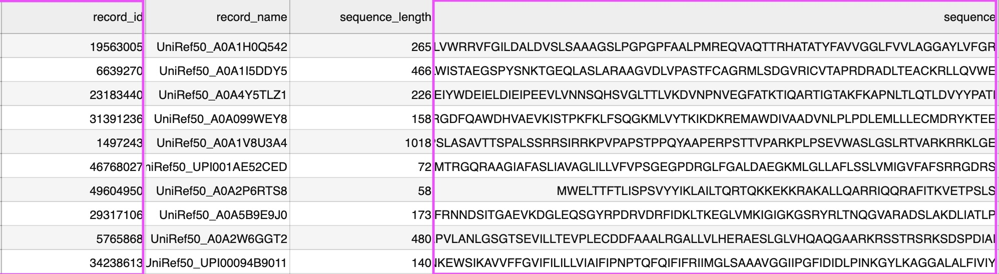
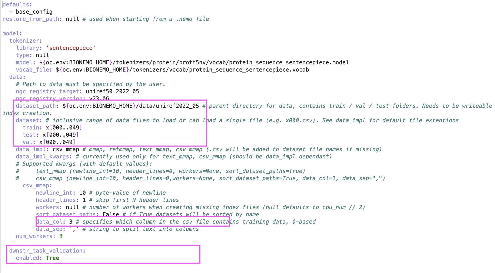
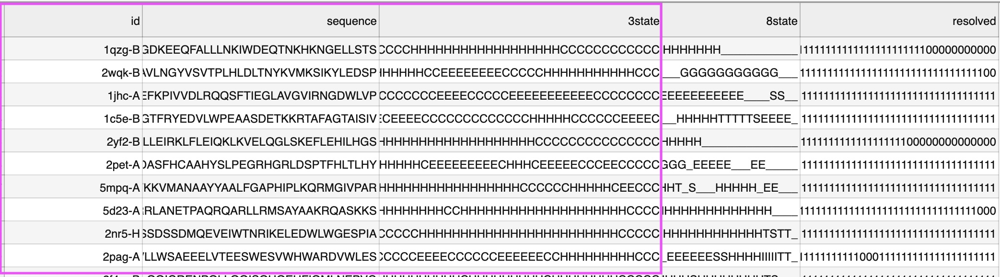
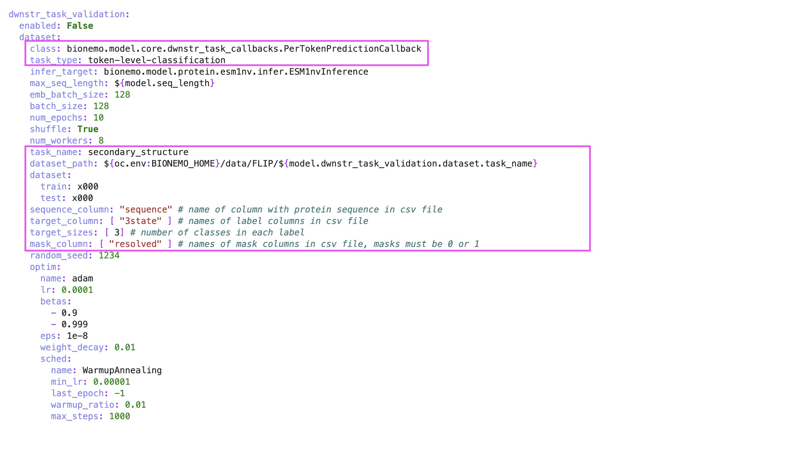
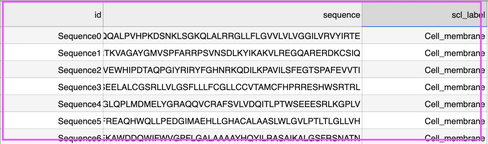
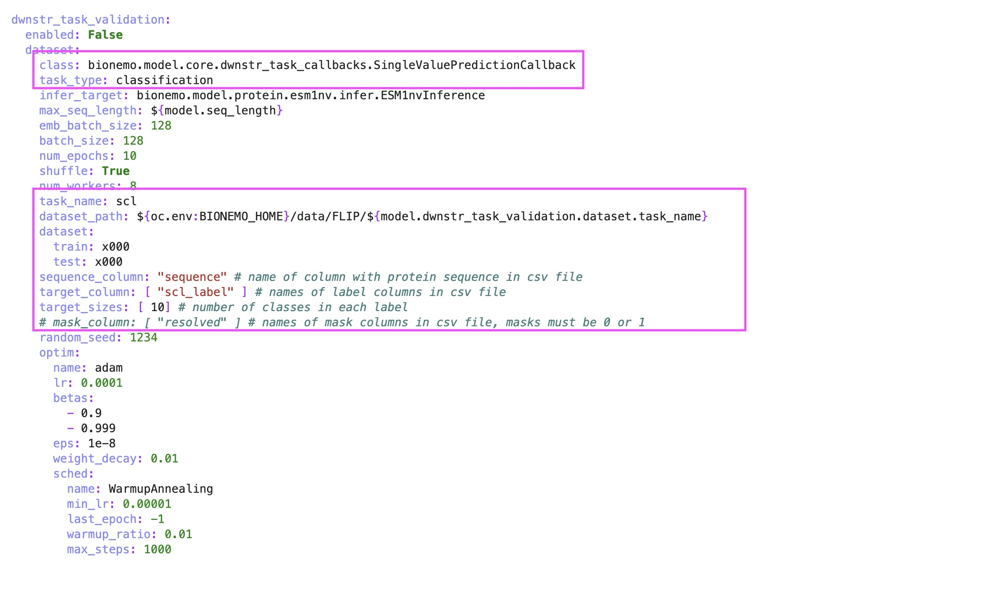
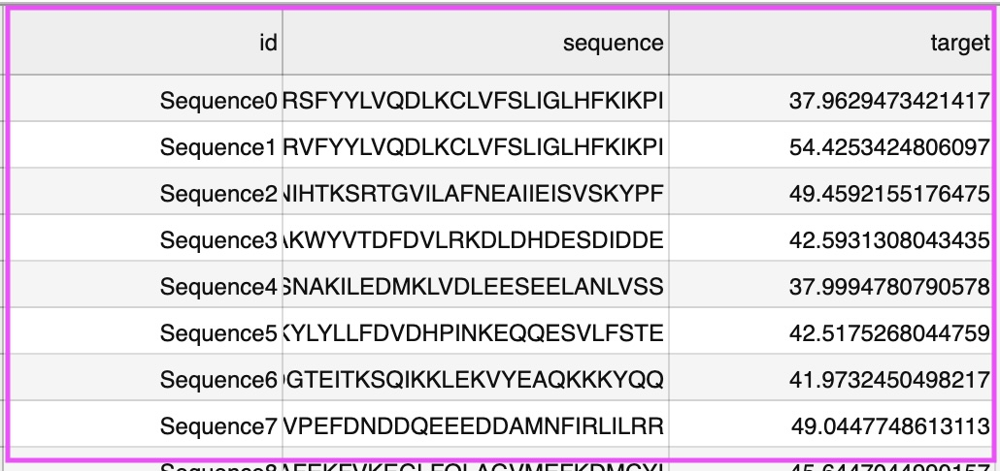
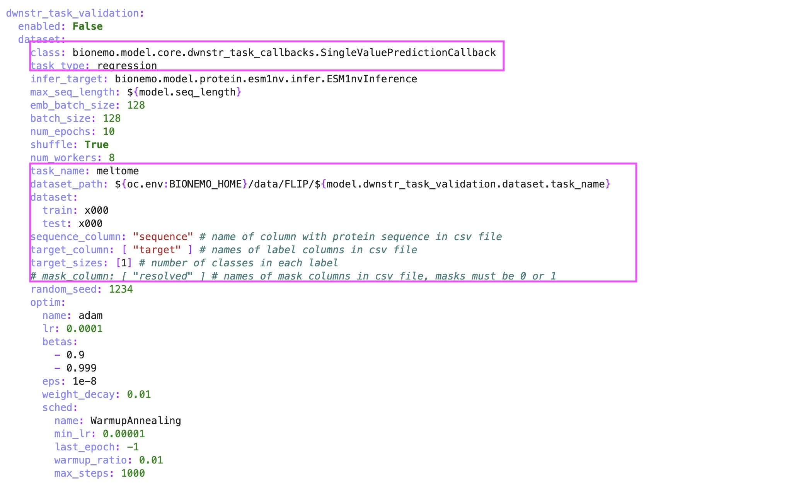

# Pretraining with custom data

## Prerequisites

1. Set up BioNeMo and have Jupyter Lab instance running.

## Step 1. Prepare clean training data

1.  In a directory inside the container, create the following folder structure:

    ```
    |-- data
        |-- train
            |-- x000.csv
            |-- x001.csv
            |-- ...
        |-- val
            |-- x000.csv
            |-- x001.csv
            |-- ...
        |-- test
            |-- x000.csv
            |-- x001.csv
            |-- ...
    ```

    * the folder names must be exactly `train`, `val`, and `test`
    * the file names must be exactly `x000.csv`, `x001.csv`, etc. You can have just 1 CSV file or split into multiple CSVs if it's too large.
    *   the CSV file must contain the following column: `record_id`, `sequence`. It's OK to have other columns which won't be used in training. Download the
        <figure><figcaption><p>ESM1nv Pretrain Input</p></figcaption></figure>
2.  Go to `examples/protein/esm1nv/conf/pretrain_small.yaml`, update the following:

    <figure><figcaption><p>Custom YAML Configuration for ESM1nv Pretraining</p></figcaption></figure>

    - `dataset_path`: set to the folder that contains train/val/test folder.
    - `dataset.train`, `dataset.val`, `dataset.test`: set to the CSV name or ranges.
    - `csv_mmap.data_col`: set 3 the index of the column containing the sequence. E.g. `3 in the above example` 
    - `downstr_task_validation.enabled`: set to `True` to enable validation-in-the-loop in Step 2.

## Step 2. (Optional) prepare clean validation-in-the-loop data

### Scenario 1: Downstream task is per-token classification

An example is 3-state structure prediction. Specifically, for each amino acid in the sequence, we want to predict whether it's in helix, sheet, or coil.

1.  In a directory inside the container, create the following folder structure:

    ```
    |-- downstream
        |-- train
            |-- x000.csv
        |-- test
            |-- x000.csv
    ```
2.  Each CSV file needs to contain `id`, `sequence`, and `target` column. For example:

    <figure><figcaption><p>Custom Downstream for 3-state Structure Prediction</p></figcaption></figure>

    \- the \`target\` column can be either \`3state\` or \`8state\`. Column name doesn't matter - the \`resolved\` column is a used as mask. This is optional. If teh structure of some residue is not resolved, you can put \`0\` in the sequence corresponding to that residue. - Download a
3. Go to `examples/protein/esm1nv/conf/pretrain_small.yaml`, make sure `dwnstr_task_validation.enabled = True`
4.  Go to `examples/protein/esm1nv/conf/base_config.yaml`, under `dwnstr_task_validation`, modify the following columns:

    <figure><figcaption><p>Custom Downstream YAML Configuration for 3-state Structure Prediction</p></figcaption></figure>

    Specifically: - \`task\_class\`: set to the \`PerTokenPredictionCallBack\`class - \`task\_type\`: set to \`token-level-classification\` - \`task\_name\`: change to whatever you want - \`dataset\_path\`: set to the folder that contains train/test folder. E.g. the \`path/to/downstream\` in the above example - \`dataset.train\`, \`dataset.test\`: set to the file name. E.g. \`x000\` in the above example - \`sequence\_column\`: set to name of the column that contains the sequence. E.g. \`sequence\` in the above example - \`target\_column\`: set to name of the column that contains the target. E.g. \`3state\` in the above example/ - \`target\_size\`: set to number of classes. E.g. \`3\` in the above example - \`mask\_column\`: set to name of the column that contains the mask. E.g. \`resolved\` in the above example. If no mask, set to \`mask\_column: \[null]\`.

### Scenario 2: Downstream task is sequence-level classification

In this example, the downstream task is subcellular location (classification of the protein sequences belonging to one of the 10 subcellular compartments)

1.  In a directory inside the container, create the following folder structure:

    ```
    |-- downstream
        |-- train
            |-- x000.csv
        |-- test
            |-- x000.csv
    ```
2.  Each CSV file needs to contain `id`, `sequence`, and `target` column. For example:

    <figure><figcaption><p>Custom Downstream for Subcellular Location Prediction</p></figcaption></figure>

    \- the \`target\` column is \`scl\_label\`. Column name doesn't matter - Download a

    
    Template CSV file
    

3. Go to `examples/protein/esm1nv/conf/pretrain_small.yaml`, make sure `dwnstr_task_validation.enabled = True`
4. Go to `examples/protein/esm1nv/conf/base_config.yaml`, under `dwnstr_task_validation`, modify the following columns:

    <figure><figcaption><p>Custom Downstream YAML Configuration for Subcellular Location Prediction</p></figcaption></figure>

    \- \`task\_class\`: set to \`SingleValuePredictionCallBack\` - \`task\_type\`: set to \`classification\` - \`task\_name\`: change to whatever you want - \`dataset\_path\`: set to the folder that contains train/test folder. E.g. the \`path/to/downstream\` in the above example - \`dataset.train\`, \`dataset.test\`: set to the file name. E.g. \`x000\` in the above example - \`sequence\_column\`: set to name of the column that contains the sequence. E.g. \`sequence\` in the above example - \`target\_column\`: set to name of the column that contains the target. E.g. \`scl\_label\` in the above example/ - \`target\_size\`: set to number of classes. E.g. \`10\` in the above example - \`mask\_column\`: comment this out.

### Scenario 3: Downstream task is sequence-level regression

In this example, the downstream task is predicting the melting temperature of the protein sequences.

1.  In a directory inside the container, create the following folder structure:

    ```
    |-- downstream
        |-- train
            |-- x000.csv
        |-- test
            |-- x000.csv
    ```
2.  Each CSV file needs to contain `id`, `sequence`, and `target` column. For example:

    <figure><figcaption><p>Custom Downstream for Melting Temperature Prediction</p></figcaption></figure>

    \- the \`target\` column is \`target\`. Column name doesn't matter - Download a


Template CSV file


3\. Go to \`examples/protein/esm1nv/conf/pretrain\_small.yaml\`, make sure \`dwnstr\_task\_validation.enabled = True\` 4. Go to \`examples/protein/esm1nv/conf/base\_config.yaml\`, under \`dwnstr\_task\_validation\`, modify the following columns:

<figure><figcaption><p>Custom Downstream YAML Configuration for Melting Temperature Prediction</p></figcaption></figure>

\- \`task\_class\`: set to \`SingleValuePredictionCallBack\` - \`task\_type\`: set to \`regression\` - \`task\_name\`: change to whatever you want - \`dataset\_path\`: set to the folder that contains train/test folder. E.g. the \`path/to/downstream\` in the above example - \`dataset.train\`, \`dataset.test\`: set to the file name. E.g. \`x000\` in the above example - \`sequence\_column\`: set to name of the column that contains the sequence. E.g. \`sequence\` in the above example - \`target\_column\`: set to name of the column that contains the target. E.g. \`target\` in the above example/ - \`target\_size\`: set to \`1\` - \`mask\_column\`: comment this out.

## Step 3. Train

1.  In the Juptyer notebook terminal, run

    ```shell
    cd /workspace/BioNeMo
    ```
2.  Run the following command to start training.

    ```shell
    python examples/protein/esm1nv/pretrain.py \
    --config-path=conf \
    --config-name=pretrain_small \
    ++do_training=True \
    ++do_testing=False \
    ++trainer.devices=1 \
    ++model.micro_batch_size=128 \
    ++trainer.max_steps=100 \
    ++trainer.val_check_interval=10 \
    ++exp_manager.create_wandb_logger=False \
    ++exp_manager.checkpoint_callback_params.save_top_k=5
    ```
