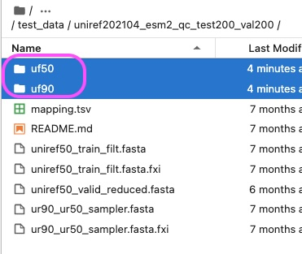
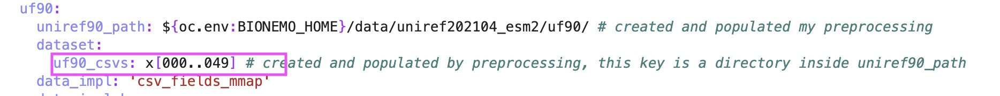

# Pretrain

## Prerequisites

1. Set up BioNeMo and have Jupyter Lab instance running.  

## Steps

### Step 1: Preprocess training data using pre-built pipeline

1. In jupyter notebook terminal, run the following command to unzip the a test dataset

    ```shell
    cd /workspace/bionemo/examples/tests/test_data/
    ```
    then
    ```shell
    unzip uniref202104_esm2_qc_test200_val200.zip
    ```

2. Run preprocess script

    ```shell
    cd /workspace/bionemo
    ```
    then
    ```shell
    python examples/protein/esm2nv/pretrain.py \
    --config-path=conf \
    ++do_training=False \
    ++model.data.val_size=500 \
    ++model.data.test_size=100 \
    ++model.data.train.uf50_datapath=/workspace/bionemo/examples/tests/test_data/uniref202104_esm2_qc_test200_val200/uniref50_train_filt.fasta \
    ++model.data.train.uf90_datapath=/workspace/bionemo/examples/tests/test_data/uniref202104_esm2_qc_test200_val200/ur90_ur50_sampler.fasta \
    ++model.data.train.cluster_mapping_tsv=/workspace/bionemo/examples/tests/test_data/uniref202104_esm2_qc_test200_val200/mapping.tsv \
    ++model.data.dataset_path=/workspace/bionemo/examples/tests/test_data/uniref202104_esm2_qc_test200_val200
    ```
    **Parameters starting with** `--` are passed to `pretrain.py` as command line arguments. For example: 

    - `config-path` and `config-name`: specify the folder and yaml file name for the configuration YAML file. This path is relative to `pretrain.py`. The `conf` refers to `examples/protein/esm2nv/conf` and `pretrain_esm2_650M` refers to `examples/protein/esm2nv/conf/pretrain_esm2_650M.yaml`.
    
    **Parameters starting with** `++` are configurable in the YAML file. For example, in `pretrain_esm2_650M.yaml`, which inherits from `base_config.yaml`, you can find these parameters: 

    - `do_training`: set to `False` to only preprocess the data. No training will be done. 
    - `model.data.val_size` and `model.data.test_size`: specify the size of the validation and test datasets.
    - `model.data.train.uf50_datapath`: specify the path to the uniref50 fasta file.
    - `model.data.train.uf90_datapath`: specify the path to the uniref90 fasta file.
    - `model.data.train.cluster_mapping_tsv`: specify the path to the mapping file that maps uniref50 cluster to uniref90 sequences
    - `model.data.dataset_path`: specify the path to the output directory for the preprocessed uniref50 and uniref90 data. After propcessing, a folder called `uf50` will be created in this directory. This folder will have train/test/val splits. Each folder will contain `x000.csv` etc. Another folder called `uf90` will also be created in this directory. This folder will have a folder called `uf90_csvs`. Inside the `uf90_csvs` folder, there will be `x000.csv` etc. There will be no train/test/val splits, because uniref90 is only used in training.

    You can also make changes directly to the YAML file, as opposed to overwritting hte arguments through command line like above. 

3. When completed, you can find the preprocessed data here: 

    <figure><figcaption><p>ESM2nv pretrain preprocess</p></figcaption></figure>


### Step 2: Train

1. In the JupyterNotebook terminal, run
    ```shell
    cd /workspace/bionemo
    ```
    then
    ```shell
      python examples/protein/esm2nv/pretrain.py \
      --config-path=conf \
      --config-name=pretrain_esm2_650M \
      ++do_training=True \
      ++do_testing=False \
      ++model.data.dataset_path=examples/tests/test_data/uniref202104_esm2_qc_test200_val200 \
      ++trainer.devices=4 \
      ++model.tensor_model_parallel_size=2 \
      ++model.micro_batch_size=8 \
      ++trainer.max_steps=100 \
      ++trainer.val_check_interval=10 \
      ++exp_manager.create_wandb_logger=False \
      ++exp_manager.checkpoint_callback_params.save_top_k=5 \
      ++model.dwnstr_task_validation.enabled=True \
      ++model.dwnstr_task_validation.dataset.dataset_path=examples/tests/test_data/protein/downstream
    ```

    **Parameters**: 

    - `do_training`: set to `True` to train the model. This assumes that the data has been preprocessed.
    - `do_testing`: set to `False` to skip testing.
    - `model.data.dataset_path`: specify the path to the preprocessed data.
    - `trainer.devices`: specify the number of GPUs to use.
    - `model.tensor_model_parallel_size`: set the tensor model parallel size.
    - `model.micro_batch_size`: set the batch size. Increase this as much as you can without memory errors.
    - `trainer.max_steps`: specify the maximum number of training steps. I set it to 100 for demo. 1 step = process 1 batch. First calculate `total_batches = Total number of samples / batch size`. If you want to train for N epochs, then set `max_steps` to `N * total_batches`.
    - `trainer.val_check_interval`: specify the interval to run the validation set. 
    - `exp_manager.create_wandb_logger`: set to `False` to disable logging to wandb. If `True`, you need to provide a wandb API key. 
    - `exp_manager.checkpoint_callback_params.save_top_k`: specify the number of best checkpoints to save.
    - `model.dwnstr_task_validation.enabled`: set to `True` to enable validation-in-the-loop. This is an optional quality control step. By default, we use the FLIP dataset for 3state structure prediction as validation task. 
    - `model.dwnstr_task_validation.dataset.dataset_path`: specify the path to the downstream task dataset. By default this will be downloaded during the preprocessing pipeline.
    
    **Note**: 

    - By default, the model will process `x000.csv` to `x049.csv` in the `train`, `val`, `test` folders. If this is not the case, you can specify a single CSV file or a custom range of CSV files in `examples/protein/esm2nv/conf/pretrain_esm2_650M.yaml`. Find `model.data.dataset` on this line: 
    
    - Similarly, by default the model will process `x000.csv` to `x049.csv` in the `examples/tests/test_data/uf90/u90_csvs` folder. If this is not the case, you can specify a single CSV file or a custom range of CSV files in `examples/protein/esm2nv/conf/pretrain_esm2_650M.yaml`. Find `model.data.uf90.uf90_csvs` on this line:

    <figure><figcaption><p></p></figcaption></figure>

2. When completed, you can find the trained model as `.nemo` file in `/workspace/bionemo/results/nemo_experiments/`. 
