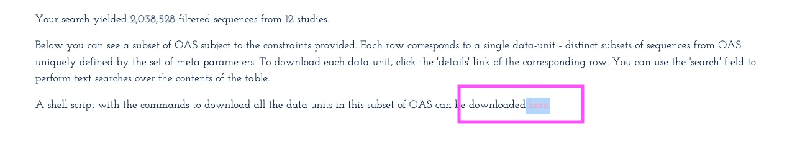
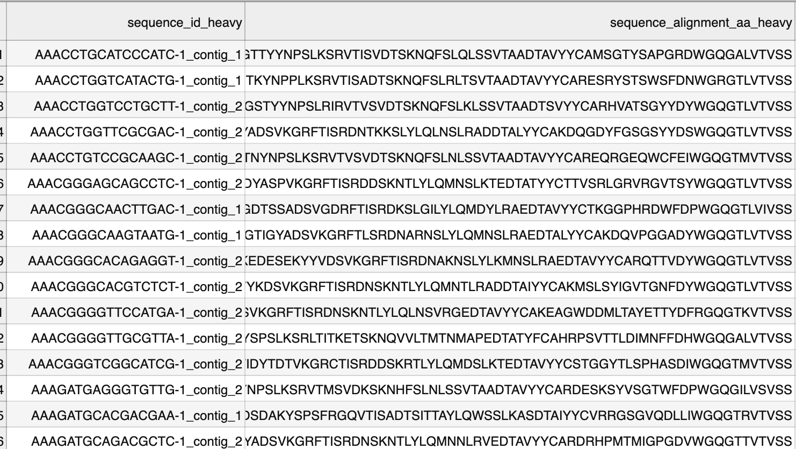

# Pretrain with OAS

## Prerequisites

1. Set up BioNeMo and have Jupyter Lab instance running.

## Steps

### 1. Prepare download script

1. Go to [OAS](https://opig.stats.ox.ac.uk/webapps/oas/oas\_paired/), do not put in any search attributes, just click on Search button.
2.  Download the shell script.

    <figure><figcaption><p>OAS Download</p></figcaption></figure>
3. Rename it to `oas_paired_subset_download.sh`. Upload to `/workspace/bionemo/bionemo/data/preprocess/protein` folder in the container

### 2. Prepare preprocessing script

1.  Download [oas_preprocess.py](./examples/scripts/pretrain_esm1nv_oas/oas_preprocess.py) to `/workspace/bionemo/bionemo/data/preprocess/protein` folder, by running the code below:&#x20;

    ```bash
    curl -o /workspace/bionemo/bionemo/data/preprocess/protein/oas_preprocess.py https://raw.githubusercontent.com/xinyu-dev/bionemo-gitbook/main/examples/scripts/pretrain_esm1nv_oas/oas_preprocess.py
    ```
2.  In this file, note this line:

    ```python
    processed_directory: str = 'OASpaired/processed/heavy'  # for LC, use OASpaired/processed/light
    columns_to_keep = ['sequence_id_heavy','sequence_alignment_aa_heavy']  # for LC, use sequence_id_light, sequence_alignment_aa_light
    ```

    As shown above, only VH is processed. If you want to process VL, make changes accordingly.

### 3. Setup config YAML

1.  Download [pretrain_oas.yaml](./examples/scripts/pretrain_esm1nv_oas/pretrain_oas.yaml) to `workspace/bionemo/examples/protein/esm1nv/conf` folder, by running the code below:&#x20;

    ```bash
    curl -o /workspace/bionemo/examples/protein/esm1nv/conf/pretrain_oas.yaml https://raw.githubusercontent.com/xinyu-dev/bionemo-gitbook/main/examples/scripts/pretrain_esm1nv_oas/pretrain_oas.yaml
    ```
2.  In the YAML file above, change the following line to activate preprocessing mode

    ```yaml
    do_training: False
    ```

### 4. Set up pretrain.py

1.  Copy [pretrain_oas.py](./examples/scripts/pretrain_esm1nv_oas/pretrain_oas.py) to `/workspace/bionemo/examples/protein/esm1nv` folder, by running the code below:&#x20;

    ```bash
    curl -o /workspace/bionemo/examples/protein/esm1nv/pretrain_oas.py https://raw.githubusercontent.com/xinyu-dev/bionemo-gitbook/main/examples/scripts/pretrain_esm1nv_oas/pretrain_oas.py
    ```

### 5. Run preprocessing

Run the python file

```shell
cd /workspace/bionemo
```

Then

```shell
python examples/protein/esm1nv/pretrain_oas.py
```

The data will be downloaded and split into train/val/test in `/workspace/bionemo/data/OASpaired/processed/heavy` folder.

The clean file looks like this:

<figure><figcaption><p>Clean File After Processing</p></figcaption></figure>

### 6. Run training

1.  In `pretrain_oas.yaml` file, set `do_training: True` activate training mode. Make sure the dataset path, train, test, val file path, and data\_col is properly set

    ```yaml
    	do_training: True
    	exp_manager:
    	create_wandb_logger: True # Enable Weights and Biases for logging
    	data:  
    	dataset_path: /workspace/bionemo/data/OASpaired/processed/heavy # parent directory for data, contains train / val / test folders. Needs to be writeable for index creation.  
    	dataset: # inclusive range of data files to load x[000..049] or can a single file, e.g. x000  
    		train: x[000..005] # change to number of files in train folder. Using 005 for demo purpose only
    		val: x[000..001]
    	data_impl_kwargs:
    		csv_mmap:
    			data_col: 1 # 0-based. Index for the column in the x000.csv file that has the protein sequence
    ```
2.  Run pretraining

    ```shell
    cd /workspace/bionemo
    ```

    Then

    ```shell
    python examples/protein/esm1nv/pretrain_oas.py
    ```

    When asked about Weights and Biases, select option 2 to use your existing WandB account, then enter your WandB API key. If you prefer not to use WandB, select option 3, or set `create_wandb_logger: False` in the YAML file.
3. The results will be saved in `/workspace/bionemo/results` folder.
