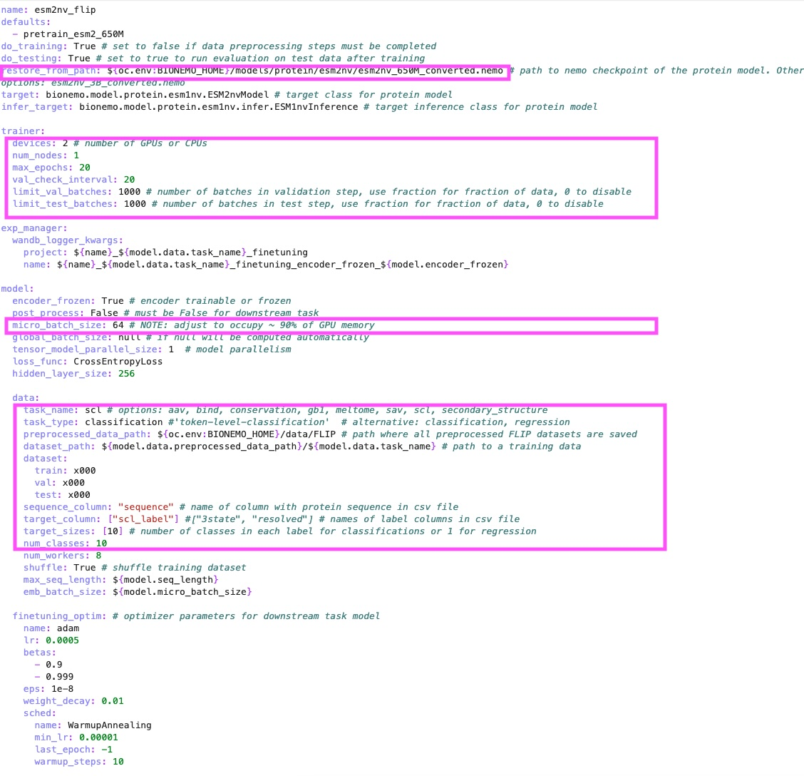
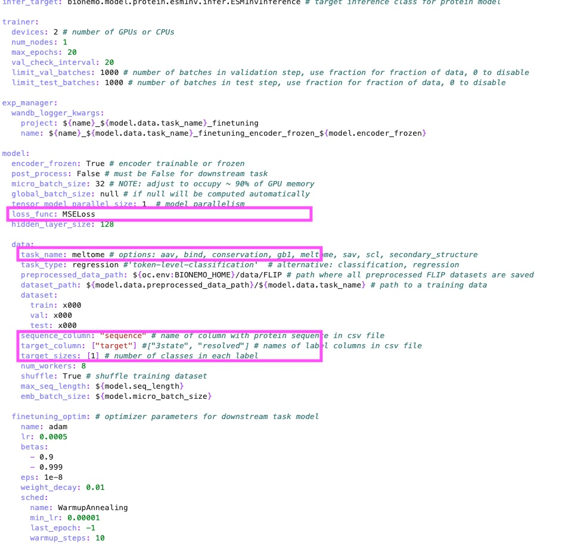
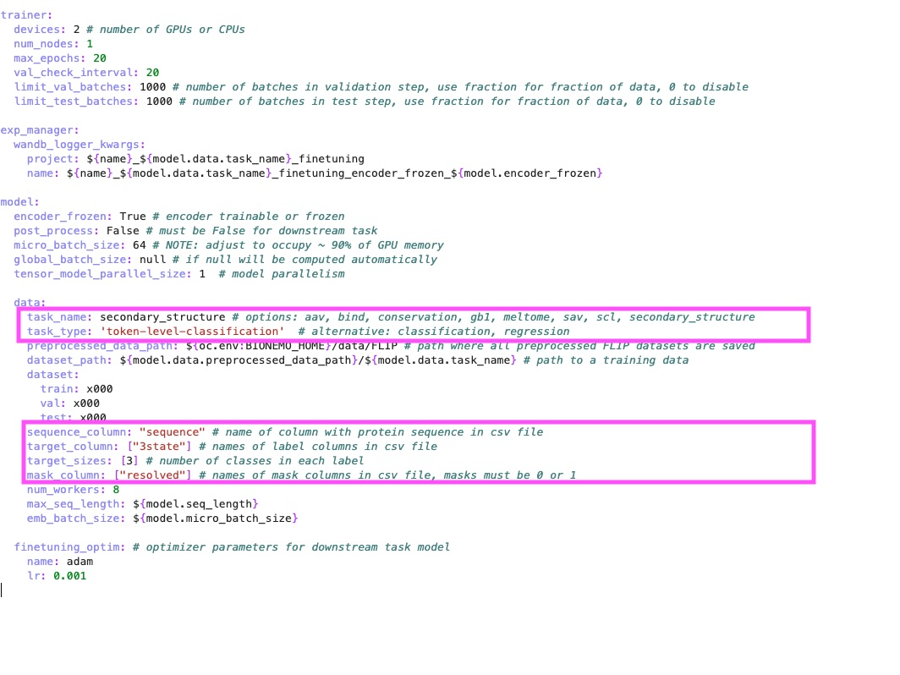
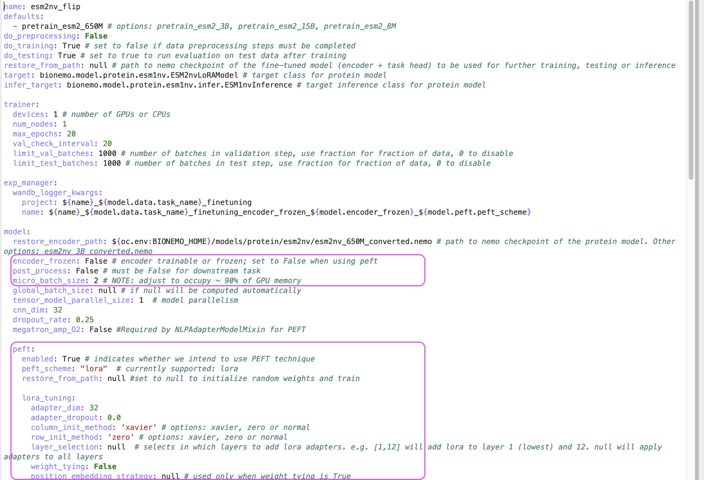

# 2. Finetune

## Prerequisites

1. Set up the BioNeMo Framework container
2. You will also need pretrained model checkpoint `.nemo` file. You can either use the pretrained models we provided or train your own.
3. This demo will show how to finetune a pretrained ESM2 model on a downstream task using the FLIP dataset. In this process, the ESM2 model's weights are frozen, and only the regressor/classifier head are trained on the downstream task.
4. In this page we will demonstrate 2 finetuning method:
   * Standard finetune
   * PEFT LoRA finetune

## Method 1: Standard finetune for sequence level classification task

In this example, we will predict the 10 subcellular localization sites of proteins, as described in the FLIP dataset.

### Prepare clean dataset

1.  Make a file structure as follows:

    ```
    data/
        train/
            x000.csv
        val/
            x000.csv
        test/
            x000.csv
    ```

    An example CSV file looks like this:

    <figure><figcaption></figcaption></figure>

    * `sequence`: the protein sequence
    * `target`: target column of the classes. Column name does not matter
    * The CSV files should be named exactly as `x000.csv`
    * Download a [template CSV file](../../example/files/flip\_scl/x000.csv)

### Setup training

2.  Navigate to `examples/protein/esm2nv/conf` folder. Click on `downstream_flip_scl.yaml` to open it in the editor. Change the following fields:

    <figure><figcaption></figcaption></figure>

    * `restore_from_path`: set to the path of the pretrained model checkpoint `.nemo` file
    * `trainer.devices`, `trainer.num_nodes`: set it to the # of GPU and nodes
    * `trainer.max_epochs`: set it to the number of epochs you want to train
    * `trainer.val_check_interval`: set it to the number of steps to run validation
    * `model.micro_batch_size`: set it to the micro batch size for training
    * `data.task_name`: can be anything
    * `data.task_type`: the current options are `token-level-classification`, `classification` (sequence level), and `regression` (sequence level)
    * `preprocessed_data_path`: Set it to the path of the parental folder tof `dataset_path`. See `dataset_path` for how this env is used
    * `dataset_path`: Set it to the folder that contains train/val/test folder. E.g. the `path/to/data` in the above example
    * `dataset.train`, `dataset.val`, `dataset.test`: set to the CSV name or ranges.
    * `sequence_column`: set to the name of the column containing the sequence. E.g. `sequence` in the above example
    * `target_column`: set to the name of the column containing the target. E.g. `scl_label` in the above example
    * `target_size`: number of classes in each label for classification.
    * `num_classes`: set it to `target_size`
3.  Run training

    ```shell
    cd /workspace/bionemo
    ```

    then

    ```shell
    python examples/protein/downstream/downstream_flip.py \
    --config-path="../esm2nv/conf" \
    --config-name=downstream_flip_scl
    ```

## Method 2: Standard finetune for sequence level regression task

In this example, we will predict the melting temperature of proteins, as described in the FLIP dataset.

### Prepare clean dataset

1.  Prepare clean file structure similar to described in the [#Scenario 1](2.-finetune.md#scenario-1-finetune-for-sequence-level-classification-task). An example CSV file looks like this:

    <figure><figcaption></figcaption></figure>

    * Download an [example CSV file](../../example/files/flip\_meltome/x000.csv)

### Setup training

2.  Navigate to `examples/protein/esm2nv/conf` folder. Click on `downstream_flip_meltome.yaml` to open it in the editor. Explanation of the parameters are similar to [#Scenario 1](2.-finetune.md#scenario-1-finetune-for-sequence-level-classification-task).

    <figure><figcaption></figcaption></figure>

    Some notable changes are: - \`loss\_fn\`: set to \`MSELoss\` - \`target\_size\`: set to \`1\`
3.  Run training

    ```shell
    cd /workspace/bionemo
    ```

    Followed by

    ```shell
    python examples/protein/downstream/downstream_flip.py \
    --config-path="../esm2nv/conf" \
    --config-name=downstream_flip_meltome
    ```

## Method 3: Standard finetune for token level classification task

In this example, we will predict 3 state structure of proteins, as described in the FLIP dataset. For each amino acid in the sequence, the model decides whehter it is in the helix, sheet, or coil.

### Prepare clean dataset

1.  Prepare clean file structure similar to described in the [#Scenario 1](2.-finetune.md#scenario-1-finetune-for-sequence-level-classification-task). An example CSV file looks like this:

    <figure><figcaption></figcaption></figure>

* For the target column (e.g. `3state`) , use a sequence of the same length as the protein sequence. Each character in the sequence represents a class (e.g. C for coil, H for helix, E for sheet)
* You can also apply a mask column. For example, `resolved` column uses a sequence of 1 and 0s that is the same lengths of the protein sequence. 1 = experimentally resolved, 0 = not resolved.
* The loss will only be calculated for the resolved positions.
* Download an[ example CSV file](../../example/files/flip\_3state/x000.csv)

### Setup training

2.  Navigate to `examples/protein/esm2nv/conf` folder. Click on `downstream_flip_sec_str.yaml` to open it in the editor. Explanation of the parameters are similar to [#Scenario 1](2.-finetune.md#scenario-1-finetune-for-sequence-level-classification-task).

    <figure><figcaption></figcaption></figure>

    A few notable changes are:

    * `loss_fn`: this no longer needs to be set. The `loss_fn` is a pre-built in `workspace/bionemo/bionemo/model/protein/downstream/protein_model_finetuning.py`, under `build_loss_fn`. THe `PerTokenMaskedCrossEntropyLoss` in this function is futhur defined in `/workspace/bionemo/model/core/cnn.py`.
    *   You can have multiple target columns in the same dataset. For example:

        ```yaml
        target_column: ["3state", "8state"]
        target_size: [3, 8]
        mask_column: ["resolved", "resolved"]
        ```

    Loss will be accumulated from both columns

    *   To remove the mask\_column, use `null`:

        ```yaml
        target_column: ["3state"]
        target_size: [3]
        mask_column: [null]
        ```
3.  Run training

    ```shell
    cd /workspace/bionemo
    ```

    then

    ```shell
    python examples/protein/downstream/downstream_flip.py \
    --config-path="../esm2nv/conf" \
    --config-name=downstream_flip_sec_str
    ```

## Method 4: LoRA finetune for token level classification task

In this example, we will predict 3 state structure of proteins, as described in the FLIP dataset. For each amino acid in the sequence, the model decides whehter it is in the helix, sheet, or coil.

### Prepare clean dataset

1.  Prepare clean file structure similar to described in the [#Scenario 1](2.-finetune.md#scenario-1-finetune-for-sequence-level-classification-task). An example CSV file looks like this:

    <figure><figcaption></figcaption></figure>

* For the target column (e.g. `3state`) , use a sequence of the same length as the protein sequence. Each character in the sequence represents a class (e.g. C for coil, H for helix, E for sheet)
* You can also apply a mask column. For example, `resolved` column uses a sequence of 1 and 0s that is the same lengths of the protein sequence. 1 = experimentally resolved, 0 = not resolved.
* The loss will only be calculated for the resolved positions.
* Download an[ example CSV file](../../example/files/flip\_3state/x000.csv)

### Setup training

2.  Navigate to `examples/protein/esm2nv/conf` folder. Click on `downstream_sec_str_LORA.yaml` to open it in the editor. Explanation of the parameters are similar to [#Scenario 1](2.-finetune.md#scenario-1-finetune-for-sequence-level-classification-task).

    <figure><figcaption></figcaption></figure>

    A few notable changes are:

    * `model.encoder_frozen=False` Set to `False` when using peft
    * `model.peft.enabled=True`: Set to `True` to enable PEFT
    * `model.peft.lora_tuning.adapter_dim` allows us to set different values for the rank used in matrix decomposition. This is a helpful hyperparameter to maximize performance on your data as it determines trainable parameters.
    *   You can have multiple target columns in the same dataset. For example:

        ```yaml
        target_column: ["3state", "8state"]
        target_size: [3, 8]
        mask_column: ["resolved", "resolved"]
        ```

    Loss will be accumulated from both columns

    *   To remove the mask\_column, use `null`:

        ```yaml
        target_column: ["3state"]
        target_size: [3]
        mask_column: [null]
        ```
3.  Run training

    ```shell
    cd /workspace/bionemo
    ```

    then

    ```shell
    python examples/protein/downstream/downstream_flip.py \
        --config-path="../esm2nv/conf" \
        --config-name=downstream_sec_str_LORA \
        ++model.micro_batch_size=4 \
        ++trainer.max_epochs=20 \
        model.peft.lora_tuning.adapter_dim=16
    ```
