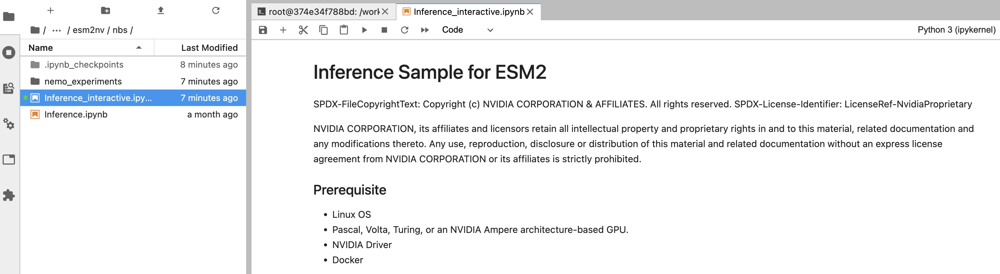

# 3. Inference

## Prerequisites

1. Set up the BioNeMo Framework container
2. You will also need pretrained model checkpoint `.nemo` file. You can either use the pretrained models we provided or train your own.

## Steps

1.  Go to `examples/protein/esm2nv/nbs` folder. Click on `inference_interactive.ipynb`.

    <figure><figcaption></figcaption></figure>
2.  By default, the default YAML file is located at

    ```python
    config_path = BIONEMO_HOME / "examples" / "protein" / "esm2nv" / "conf" # /workspace/bionemo/examples/protein/esm2nv/conf
    cfg = load_model_config(config_path, config_name="infer.yaml") # infer.yaml
    ```
3.  Open the `infer.yaml` file and update the following fields.

    ```yaml
    downstream_task:
        restore_from_path: "${oc.env:BIONEMO_HOME}/models/protein/esm2nv/esm2nv_650M_converted.nemo" # Path to pretrained checkpoint.
    ```

    * `restore_from_path`: path to the default `nemo` model checkpoint. If needed, update it to where your checkpoint is located.
    * `dataset_path`: this doesn't matter
4. Go back to the `inference_interactive.ipynb` and run the cells.
   * **Sequence to hidden states**: this generates per token embedding
   * **Sequence to embedding**: this generates per sequence embedding

## Notes

### Consistency of EMS2nv generated embeddings

We have observed that rounding errors in the embeddings generated by ESM2nv in different batches.

For example, consider the following example:

```python
short_seq = 'MQLYLVLLLISYLLTPIGASILGRCTVAKMLYDGGLNYFEGYSLENWVCLAYFESKFNPSAVYEDPQDGSTGFGLFQIRDNEWCGHGKNLCSVSCTALLNPNLKDTIQCAKKIVKGKHGMGAWPIWSKNCQLSDVLDRWLDGCDL'
long_seq = 'MKWVTFISLLLLFSSAYSRGVFRRDTHKSEIAHRFKDLGEEHFKGLVLIAFSQYLQQCPFDEHVKLVNELTEFAKTCVADESHAGCEKSLHTLFGDELCKVASLRETYGDMADCCEKQEPERNECFLSHKDDSPDLPKLKPDPNTLCDEFKADEKKFWGKYLYEIARRHPYFYAPELLYYANKYNGVFQECCQAEDKGACLLPKIETMREKVLASSARQRLRCASIQKFGERALKAWSVARLSQKFPKAEFVEVTKLVTDLTKVHKECCHGDLLECADDRADLAKYICDNQDTISSKLKECCDKPLLEKSHCIAEVEKDAIPENLPPLTADFAEDKDVCKNYQEAKDAFLGSFLYEYSRRHPEYAVSVLLRLAKEYEATLEECCAKDDPHACYSTVFDKLKHLVDEPQNLIKQNCDQFEKLGEYGFQNALIVRYTRKVPQVSTPTLVEVSRSLGKVGTRCCTKPESERMPCTEDYLSLILNRLCVLHEKTPVSEKVTKCCTESLVNRRPCFSALTPDETYVPKAFDEKLFTFHADICTLPDTEKQIKKQTALVELLKHKPKATEEQLKTVMENFVAFVDKCCAADDKEACFAVEGPKLVVSTQTALA'

input1 = [short_seq]
input2 = [short_seq, short_seq]
input3 = [short_seq, long_seq]

```

We embed `input1`, `input2`, and `input3` seprately, and compare the embeddings for `short_seq`:

```python
result1 = inferer.seq_to_hiddens(input1)[0][0, :].cpu()
result2a = inferer.seq_to_hiddens(input2)[0][0, :].cpu() # same seq, at index 0 in the array
result2b = inferer.seq_to_hiddens(input2)[0][1, :].cpu() # same seq, at index 1 in the array
result3 = inferer.seq_to_hiddens(input3)[0][0, :].cpu()
```

We observed that `result 1` = `result 2a` = `result 2b` :

```python
assert np.array_equal(result1, result2a)
assert np.array_equal(result1, result2b)
```

On the other thand, `result3` has a different shape, because the sequence was padded to the longer sequence in the list. So we will remove the paddings first and then compare:

```python
result3_paddings_removed = result3[:147, :]

# the actual embeddings between result1 and result3 are NOT exactly the same
assert not np.array_equal(result1, result3_paddings_removed)

# they are slightly different
assert np.allclose(result1[1:146, :], result3[1:146, :], atol=0.02, rtol=0)
```

**What about ESM2 (Github)?**

We repeated the tests for the ESM2 (v2.0.0) model from GitHub and observed similar inconsistent embeddings due to batch effects. See [this notebook](../../.gitbook/assets/notebooks/esm2nv/esm2\_github\_embedding\_consistency.ipynb) for the details.

**The solution: to generate the exact same embedding of a given protein, use a batch size of 1 when running the inference. For example:**

```python
N = 10
# running inference 10 time
for n in range(N): 
	# but each time, we only embed 1 protein
    result = inferer.seq_to_hiddens(input1)[0][0, :].cpu()
    # this generates exactly the same array at each round
    assert np.array_equal(result1, result)
```

To try it out on your own, refer to [this notebook](../../.gitbook/assets/notebooks/esm2nv/esm2nv\_embedding\_consistency.ipynb)

### Does ESM2nv generates the same embedding as the Github ESM2?

The embeddings from ESM2nv from BioNeMo Framework, ESM2nv from the legacy BioNeMo service (aka accessed through API), and [original Github ESM2](https://github.com/facebookresearch/esm) are **NOT exactly the same**. For more details, refer to [this notebook](../../.gitbook/assets/notebooks/esm2nv/esm2\_fw\_service\_github\_comparison.ipynb).

If you're considering switching from your current EMS2 model, it's advisable to first test the embeddings.
