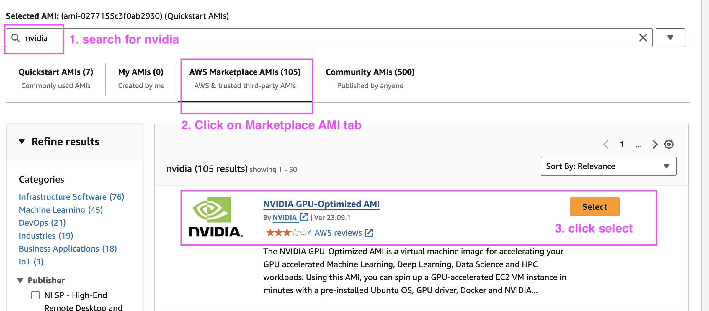

# EC2

## Prerequisites


[configure-ngc-api-key.md](../configure-ngc-api-key.md)


## Steps

### Step 1: Launch an EC2 instance

1.  In [AWS EC2 console](https://us-east-1.console.aws.amazon.com/ec2/home?region=us-east-1), click on **Launch Instance**. This will open a instance specification page.

    <figure><figcaption><p>Launch Instance</p></figcaption></figure>
2.  **Name**: enter a name for your instance

    <figure><figcaption><p>Name Instance</p></figcaption></figure>
3. Under **Application & OS Images**:
   *   select **Browse more AMIs**.

       <figure><figcaption><p>Browse AMIs</p></figcaption></figure>
   *   Type `nvidia` in the search bar. Press `Enter`. Then click on **AWS Marketplace AMI**. Then select **NVIDIA GPU Optimized VMI** and click on **Select**.

       <figure><figcaption><p>choose AMI</p></figcaption></figure>
   * When prompted, select **Subscribe Now**
4.  Under **instance type**, select **p3dn.24xlarge**.

    <figure><figcaption><p>choose instance</p></figcaption></figure>
5.  Under **key pair**: Choose an existing key pair or create a new one. If you create a new one, enter a keypair name, then select **RSA** and **.pem**. Download the **.pem** file for later use.

    <figure><figcaption><p>choose key pair</p></figcaption></figure>
6.  Under **Network settings**: choose the network, subnet, and security group that you want to use. An example is shown below but should be modified according to your organization's policies.

    <figure><figcaption><p>choose network</p></figcaption></figure>
7. Keep other settings default (or change them as needed). At least 124G root EBS volume is recommended as shown in the default setting for pretrained models & datasets.
8. Click on **Launch Instance**. Wait until the `Instance State` becomes `running`.

### Step 2. Connect to a running instance

1.  In the EC2 console, wait until the instance state becomes `running`. Then copy the **Public IP4 address** or **Private IP4 address** of the instance, depending on your network settings.

    <figure><figcaption><p>copy IP</p></figcaption></figure>
2.  Open a terminal at the local folder where you keep the **.pem** file that was used during instance launch. Run the following command to change the permissions of the **.pem** file. Replace `your-key-pair.pem` with the name of your **.pem** file.

    ```shell
    chmod 400 your-key-pair.pem
    ```
3.  SSH into the instance.Replace `your-ip4-address` with the public or private IP4 address of your instance.

    ```shell
    ssh -i your-key-pair.pem -L 8888:127.0.0.1:8888 ubuntu@your-ip4-address
    ```
4. The first time when you log into the instance, driver installation will start automatically. Wait until the system is ready.

### Step 3. Pull the BioNeMo container

1.  NGC CLI is preinstalled. (If not, you can install it from [here](https://org.ngc.nvidia.com/setup/installers/cli)) In the ubuntu terminal, type

    ```shell
    ngc config set
    ```
2. Enter the information as prompted:
   * `API key`: enter API key,
   * `CLI output`: accept default (ascii) by pressing `Enter`
   * `org`: Enter the NGC org you're assigned with
   * `team`: Enter the NGC team you're assigned with
   * `ace`: Enter the `ace` and press `Enter`
3.  If this is a newly created instance, in order to use docker without `sudo`, run:

    ```shell
    newgrp docker
    ```

    Alternatively, you can just exit the SSH connection and reconnect.&#x20;
4.  Pull the BioNeMo container image from NGC.

    ```shell
    docker pull nvcr.io/nvidia/clara/bionemo-framework:1.5
    ```

### Step 4. Run the BioNeMo container

1.  In the ubuntu terminal, make a new folder so we can mount it to docker to persist data. Replace `xyu-workspace1` with your folder name.

    ```shell
    cd ~ && mkdir xyu-workspace1
    ```
2.  Start the container. Replace `xyu-workspace1` with your workspace name.

    
    ```shell
    docker run --rm -d --gpus all -p 8888:8888 -v /home/ubuntu/xyu-workspace1:/workspace/bionemo/xyu-workspace1 nvcr.io/nvidia/clara/bionemo-framework:1.5 "jupyter lab --allow-root --ip=* --port=8888 --no-browser --NotebookApp.token='' --NotebookApp.allow_origin='*' --ContentsManager.allow_hidden=True --notebook-dir=/workspace/bionemo"
    ```
    

    * The `/workspace/bionemo` is the directory inside the container that contains the example and code. I prefer to use it as my home directory when working inside the container. Mount your local folders to this directory by changing the path in `-v` tag.
3. You can now access JupyterLab by visitn `localhost:8888` in your web browser.
4. To download the pretrained model weights, open a terminal in JupyterLab.
5. In the terminal, run the `ngc config set` again to set the NGC credentials inside the container.
6. Then we need to download the model checkpoints.  You can either 1) download all model checkpoints in BioNeMo, or 2) download selected models.&#x20;
   * **Tip 1:** To see a list of available models, navigate to `/workspace/bionemo/artifact_paths.yaml` file.&#x20;
   * &#x20;**Tip 2**: For convenience, we will download the model checkpoints to `/workspace/bionemo/models` folder. This is achieved using the `--download_dir ${BIONEMO_HOME}/models` below.  While this path is configurable by user, it is the default path in the built-in `infer.yaml` files. &#x20;
   *   **Method 1: Download all models in BioNeMo Framework**

       ```shell
       cd /workspace/bionemo && python download_models.py all \
       --source ngc \
       --download_dir ${BIONEMO_HOME}/models \
       --verbose
       ```
   *   **Method 2: Download the model you specify:**&#x20;

       ```shell
       cd /workspace/bionemo && python download_models.py <model-name> \
       --source ngc \
       --download_dir ${BIONEMO_HOME}/models \
       --verbose
       ```

       For example, to download MegaMolBART, replace `<model-name>` with `megamolbart` like this:&#x20;

       ```shell
       cd /workspace/bionemo && python download_models.py megamolbart \
       --source ngc \
       --download_dir ${BIONEMO_HOME}/models \
       --verbose
       ```
7.  Optionally, persist the models by copying them to your workspace

    
    ```shell
    mkdir -p xyu-workspace1/bionemo && cp -r models xyu-workspace1/bionemo/models
    ```
    

    Next time, when you launch the container, you can mount the `models` folder to the container under the `/workspace/bionemo` directory.
8.  The final directory structure should look like this:

    <figure><figcaption><p>ngc-jupyterlab</p></figcaption></figure>

## Notes

### Choice of instance type.

We test BioNeMo on A100, H100, but usually V100 and A10 can also be used.

### Alternative virtual machine images

Instead of using the  **NVIDIA GPU Optimized VMI** , you can also use other VMI from the market place, provided by AWS, or built by your self. The general consideration is:&#x20;

1. x86 Linux system (e.g. Ubuntu 22.04) with GPU support. See [this page](https://docs.nvidia.com/bionemo-framework/latest/pre-reqs.html) for more details
2. Docker
3. CUDA drivers
4. NVIDIA docker container toolkits.&#x20;

The easiest way to test if you have these ready is by running this command:&#x20;

```bash
docker run --rm --runtime=nvidia --gpus all ubuntu nvidia-smi
```

It should produce something similar to this, depending on your system

```
+-----------------------------------------------------------------------------------------+
| NVIDIA-SMI 550.54.14              Driver Version: 550.54.14      CUDA Version: 12.4     |
|-----------------------------------------+------------------------+----------------------+
| GPU  Name                 Persistence-M | Bus-Id          Disp.A | Volatile Uncorr. ECC |
| Fan  Temp   Perf          Pwr:Usage/Cap |           Memory-Usage | GPU-Util  Compute M. |
|                                         |                        |               MIG M. |
|=========================================+========================+======================|
|   0  NVIDIA H100 80GB HBM3          On  |   00000000:1B:00.0 Off |                    0 |
| N/A   36C    P0            112W /  700W |   78489MiB /  81559MiB |      0%      Default |
|                                         |                        |             Disabled |
+-----------------------------------------+------------------------+----------------------+

+-----------------------------------------------------------------------------------------+
| Processes:                                                                              |
|  GPU   GI   CI        PID   Type   Process name                              GPU Memory |
|        ID   ID                                                               Usage      |
|=========================================================================================|
|  No running processes found                                                             |
+-----------------------------------------------------------------------------------------+
```

### Volume

Instead of creating a local folder on EBS, you can also mount [EFS](https://aws.amazon.com/efs/) or [Lustre](https://aws.amazon.com/fsx/lustre/) folders to share across EC2 instances
