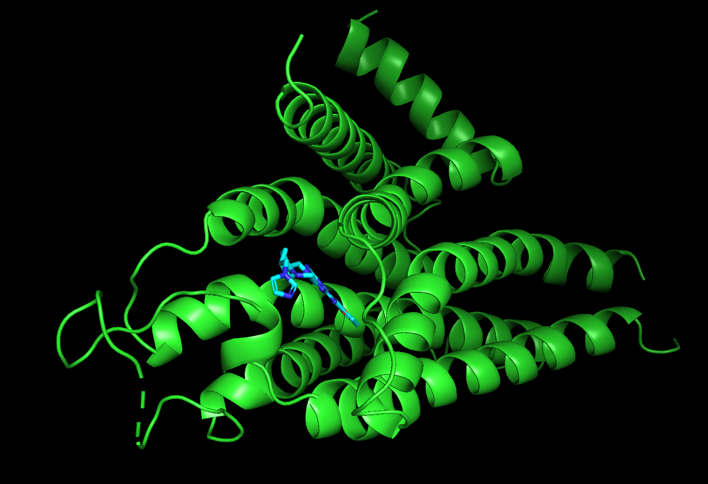

# Quick Start


This guide assumes you're hosting NIM on your own infrastructure. See [Get access to NIMs](../../nim-setup/1.-request-nim-access.md) page on the different ways to access NIM. Search [this page](https://docs.nvidia.com/) for official docs on NIMs


## Prerequisites

1. Complete the **NIM Setup** section.

## Step 1. Download NIM container

```bash
docker pull nvcr.io/nim/mit/diffdock:1.2.0
```

## Step 2. First time set up

### Cache model weights


This section is applicable if 1) this is your first time running Diffdock NIM, and 2) you would like to save hte model weights and triton configs on the local volume (which is recommended). Otherwise skip this section.


1.  cache the model weights and triton configs in local volume, so that you don't have to re-download the model every time you launch the NIM container. Assuming that we will create this cache folder at `~/nim` , run:

    ```bash
    export LOCAL_NIM_CACHE=~/nim && mkdir -p "$LOCAL_NIM_CACHE" && chmod 777 $LOCAL_NIM_CACHE
    ```
2.  I also recommend adding this to bash profile, so that next time you do not have to set it again

    ```bash
    echo "export LOCAL_NIM_CACHE=~/nim" >> ~/.bash_profile \
    && source ~/.bash_profile
    ```
3.  Then run

    ```bash
    docker run --rm -it --name diffdock-nim \
      --gpus all \
      -e NGC_API_KEY=$NGC_API_KEY \
      -v "$LOCAL_NIM_CACHE:/home/nvs/.cache/nim" \
      -p 8000:8000 \
      nvcr.io/nim/mit/diffdock:1.2.0
    ```

    * To use only 1 GPU, replace `--gpus all` with `-e CUDA_VISIBLE_DEVICES=0`
    * this command mounts the cache folder that contains model weights to the container.
    * When the command is invoked, it looks for the `$LOCAL_NIM_CACHE` folder to see if model weights and triton configs are already there. If not, it will download those files.
    * If encountering "unauthorized" error, check out the&#x20;
4.  Wait until it says something like this

    ```
    Uvicorn running on http://0.0.0.0:8000 (Press CTRL+C to quit)
    ```
5. Press CTRL+C to quit the running container. You should see model weights and triton config in your local `$LOCAL_NIM_CACHE` folder.

### Change triton config


This section is applicable if you are running on a multi-GPU instance. Make sure you cached local weights and triton configs prior to starting this part


We will need to manually update the triton config so that it correctly recognizes the number of GPUs on your instance. To do this, we will need to update `config.pbtxt` stored in the `$LOCAL_NIM_CACHE/models/bionemo-diffdock_v1.2.0/diffdock` folder to match the exact number of GPUs on your instance. First, run:

```bash
cd $LOCAL_NIM_CACHE/models/bionemo-diffdock_v1.2.0/diffdock
```

Make sure you change the diffdock version `1.2.0` to the version that matches your container. Then, run:

```bash
nvidia-smi
```

This will display the number of GPUs. For example, I have a 8-GPU instance, so I will run:

```bash
chmod +x configure_instances.sh && ./configure_instances.sh 0 1 2 3 4 5 6 7
```

It will show a warning that there is already a file there. Ignore it. Once this commands is executed, you can run ,

```
nano config.pbtxt
```

you should be able to find a block of text that looks like this:

```bash
	instance_group [
  {
	count: 1
	kind: KIND_GPU
	gpus: [0]
  },
  {
	count: 1
	kind: KIND_GPU
	gpus: [1]
  },
  {
	count: 1
	kind: KIND_GPU
	gpus: [2]
  },
  {
	count: 1
	kind: KIND_GPU
	gpus: [3]
  },
  {
	count: 1
	kind: KIND_GPU
	gpus: [4]
  },
  {
	count: 1
	kind: KIND_GPU
	gpus: [5]
  },
  {
	count: 1
	kind: KIND_GPU
	gpus: [6]
  },
  {
	count: 1
	kind: KIND_GPU
	gpus: [7]
  }
]
```

This should match the GPU devices you specified. Similarly, if you have a 4-GPU instance, you can just do `./configure_instances.sh 0 1 2 3`. Because this modified file is cached on local volume, in the future, we can simply do `docker run` command without having to worry about the config file.\\

## Step 3. Launch container

1.  Open a terminal, run

    ```bash
    echo $LOCAL_NIM_CACHE
    ```

    to make sure the environment variable is correctly set. This variable should point to the a folder like `~/nim` as described in the [#step-2.-first-time-set-up](quick-start.md#step-2.-first-time-set-up "mention") section.
2.  Run:

    ```bash
    nano $LOCAL_NIM_CACHE/models/bionemo-diffdock_v1.2.0/diffdock/config.pbtxt
    ```

    Look for the variable `instance_group`. Make sure that it is set up correctly to reflect the number of GPUs that you have. If not, refer to the [#step-2.-first-time-set-up](quick-start.md#step-2.-first-time-set-up "mention") section on how to update it.
3.  Launch the docker container:

    ```bash
    docker run --rm -it --name diffdock-nim \
      --gpus all \
      -e NGC_API_KEY=$NGC_API_KEY \
      -v "$LOCAL_NIM_CACHE:/home/nvs/.cache/nim" \
      -p 8000:8000 \
      nvcr.io/nim/mit/diffdock:1.2.0
    ```
4.  Wait until it says something like this

    ```
    Uvicorn running on http://0.0.0.0:8000 (Press CTRL+C to quit)
    ```

## Step 4. Health check

With the triton server running, we can conduct a health check. Open a new terminal on your instance, then run:

```
curl localhost:8000/v1/health/ready
```

It should return `true`.

Alternatively, if you have set up port forwarding as described in the NIM setup section, you can also use the ip4 address (e.g. something like `54.213.253.211` of your EC2 instance. Open up a terminal on a remote terminal (e.g. you laptop), run:

```
curl <ip4>:8000/v1/health/ready
```

## Step 5. Set up urls and functions

### 3.1 Import packages

````python
```python
import requests
import os
import numpy as np
```
````

### 3.2 Util functions

````python
```python
# utility function to prepare (start clean) the output directory
def prepare_directory(temp):
    import os, shutil
    """
    Create a new directory and delete the old one if it exists
    :param temp: str: path to the directory
    """
    if os.path.exists(temp):
        # Remove the directory and all its contents
        shutil.rmtree(temp)
    # Recreate the directory
    os.makedirs(temp)
```
````

### 3.3 Set up the urls

````python
```python
# if NIM is launched in a remote server, replace localhost with the IP address of your instance
base_url = "http://localhost:8000" 
query_url = base_url + "/molecular-docking/diffdock/generate"
health_check_url = base_url + "/v1/health/ready"

# run health check
response = requests.get(health_check_url)
assert response.text == "true", "Health check failed"
```
````

Continue to the **Usage case section below.**

## Usage case 1: single GPU, small dataset


This section is for running NIMs on single GPU in instance. It will also work if you have multiple-GPU instance, but because we are not using `asyncio`, you will be utilizing only GPU:0 instead of all the GPUs. Refer to the the next section for running on multiple GPUs


### Input file structure

Prepare a file structure like this:

```bash
batch_input_small/
├── input_smiles.txt
├── receptor.pdb
```

Specifically:

* `input_smiles.txt`: a txt file with SMILES strings, one per line.
* `receptor.pdb`: a PDB file of the target

**Example files**: See [batch\_input\_small](https://github.com/xinyu-dev/bionemo-gitbook/tree/main/examples/data/diffdock\_nim\_input/batch\_input\_small) folder. These are taken from [DUD-E](https://dude.docking.org/). The example has 3 compounds for aa2ar

### Run prediction

````python
```python
def submit_query(protein_file_path, ligand_file_path, num_poses=20, time_divisions=20, steps=18):
    """
    Submit a query to the server
    :param protein_file_path: path to the protein file, must be a PDB file
    :param ligand_file_path: path to the ligand file, must be a txt, SDF, MOL2, file. If using batch-docking, only txt and SDF are supported. 
    :param num_poses: int, number of poses to be generated, default is 20
    :param time_divisions: int, number of time divisions, default is 20
    :param steps: int, number of diffusion steps, default is 18
    :return: dict of response, status code and JSON response content if successful, otherwise return status code and error message
    """

    with open(protein_file_path, 'r') as file:
        protein_bytes = file.read()
    with open(ligand_file_path, 'r') as file:
        ligand_bytes = file.read()

    ligand_file_type = ligand_file_path.split('.')[-1]
    
    data = {
        "ligand": ligand_bytes,
        "ligand_file_type": ligand_file_type, # txt, sdf, mol2
        "protein": protein_bytes,
        "num_poses": num_poses,
        "time_divisions": time_divisions,
        "steps": steps,
        "save_trajectory": False, # diffusion trajectory
        "is_staged": False
    }
    
    headers = {"Content-Type": "application/json"}

    with requests.post(query_url, headers=headers, json=data) as response:
        status_code = response.status_code
        try:
            response.raise_for_status() # optional, immediately fails if the status code is not 200
            output = {
                "status_code": status_code,
                "response": response.json()
            }
        except:
            output = {
                "status_code": status_code,
                "response": response.text()   
            }
    
    return output

```
````

Now we will run prediction with 3 ligands in the `input_smiles.txt` file:

1. Each of the ligands will be docked to the protein in `receptor.pdb` file.
2. The number of poses will be 5.
3. The number of time divisions will be 20.
4. The number of diffusion steps will be 18.

````python
```python
%%time
result = submit_query(
    protein_file_path="data/batch_input_small/receptor.pdb",
    ligand_file_path="data/batch_input_small/input_smiles.txt",
    num_poses=5, 
    time_divisions=20, 
    steps=18
)
```
````

Output looks something like this:

```
CPU times: user 5.6 ms, sys: 499 μs, total: 6.09 ms
Wall time: 7.47 s
```

### Analyze results

````python
```python
response = result['response']
response.keys()
```
````

Output looks like this:

```
dict_keys(['trajectory', 'ligand_positions', 'position_confidence', 'status', 'protein', 'ligand'])
```

#### Status

This shows the success or failed status of each ligand

```python
# 3 input ligand, all showed success
response['status']
```

Out:

```
['success', 'success', 'success']
```

#### Trajectory

`trajectory`is the diffusion trajectory. Because we set `"save_trajectory": False`, it is just empty lists.

#### Ligand poses

`ligand_positions` are the predicted poses. Becuase we set `num_poses=5`, for each ligand we will have 5 poses:

````python
```python
poses = response['ligand_positions']

assert len(poses) == 3 # we have 3 ligandsin the `input_smiles.txt` file. 

# let's look at the first ligand. It has 5 predicted poses
assert len(poses[0]) == 5

# let's look at the first pose of the first ligand. 
poses[0][0]
```
````

#### Pose confidence score

`position_confidence` is the confidence score of each pose. The higher the better. A confidence score of 0 means that there is 50% chance the predicted pose is within RMSD< 2A from the ground truth.

By default, the `ligand_positions` is a 1:1 match with the `position_confidence`. For example, the 1st pose in the `ligand_positions` matches to the 1st score in the `position_confidence`, the 2nd pose matches to the 2nd score, and so on.

By default, the `position_confidence` is sorted from high (best) to low (worst). This means that, the 1st pose in `ligand_positions` is the one with the highest confidence score.

```python
# this is a list of 3 input ligands
assert len(response['position_confidence']) == 3

# each sublist has 5 scores, one score for each pose
assert len(response['position_confidence'][0]) == 5

# here is what the confidence scores of the 1st ligand looks like
response['position_confidence'][0]
```

Out:

```
[0.12911391258239746,
 0.07320181280374527,
 -0.00487934798002243,
 -0.07097923755645752,
 -3.1280288696289062]
```

The actual confidence scores will be different in each run

#### Writing the output file

We need to write the poses to SDF file. One way to do this is to combine all poses of all ligands into one single SDF file. This is especially helpful if you have a large number of ligands the input file. Combining the predicted poses into one file can save some file operations, e.g. if you want to copy the data to another location.

To do this, we will:

1. filter the ligands by the status. We don't want to write the failed ligands to file.
2. For all the successful ligands, we will write the poses to a single SDF file.
3. The poses will be named as `ligand_0_pose_0`, `ligand_0_pose_1` etc
4. Diffdock poses are not guaranteed to be valid. So we will use RDKit to sanitize the molecules before writing them to file.
5. We will save the confidence score as a property `Confidence` of the molecule.

Below is a script that does this:

First, install RDKit:

```bash
pip install rdkit
```

Then:

```python
from rdkit import Chem
from rdkit.Chem import AllChem, SDWriter

# change it to your desired output directory. use the `prepare_directory` function to start clean. 
output_dir = "output/batch_output_small" 
prepare_directory(output_dir) 

# output SDF file which has all ligands and all poses
output_sdf_file = os.path.join(output_dir, 'output.sdf') # output file path

# create a writer
writer = SDWriter(output_sdf_file)

# select indices where status is succes
status_array = np.array(response['status'])
success_indices = np.where(status_array == 'success')[0]

for i in success_indices:
    # e.g. ligand ID will be ligand_0, ligand_1, etc
    ligand_id = 'ligand_' + str(i)

    # get the ligand poses and confidence scores
    ligand_positions = response['ligand_positions'][i]
    confidence_scores = response['position_confidence'][i]

    # write to SDF file
    for idx, sdf_str in enumerate(ligand_positions):
        mol = Chem.MolFromMolBlock(sdf_str)
        if mol:
            try: 
                # sanitize the molecule
                Chem.SanitizeMol(mol)
                # set the name, like ligand_0_pose_0, ligand_0_pose_1, etc 
                mol.SetProp("_Name", ligand_id+f'_pose_{str(idx)}')
                # set the confidence score as a property
                mol.SetProp("Confidence", str(np.round(confidence_scores[idx], 4)))
                writer.write(mol)
            except:
                print(f"Failed to sanitize molecule {ligand_id}_pose_{str(idx)}")
                continue

```

To visualize the results in Pymol, load the `output.sdf` file and the `receptor.pdb` file. You will be able to cycle through the poses like this:

<figure><figcaption><p>Example of a predicted pose visualized by Pymol</p></figcaption></figure>

#### Input protein and ligand files

```python
# string, input protein PDB file
response['protein']
```

```python
# string, input ligand file
response['ligand']
```

Check out the [complete notebook](../../examples/notebooks/Diffdock/NIM/run\_diffdock\_nim.ipynb).

## Usage case 2: multi GPU, large dataset

In a multi-GPU instance, triton will handle concurrent requests and distribute them across the GPUs.

Here is one way to do this:

1. Split our input file into `N` batches, where `N` = number of GPUs on your instance.
2. Use `asyncio` to simulataneoulsy sumbit these batches to the server.
3. Triton server will parallelize the requests to the GPUs and return the results of each GPU.
4. We will process the results of each GPU and combine them into a single SDF file.

### Input file structure

Prepare a file structure like this:

```bash
batch_input_large/
├── target1
    |--receptor.pdb
    |--batches
        |--batch_0
            |--status.csv
        |--batch_1
            |--status.csv
        |--batch_2
            |--status.csv
        |--batch_3
            |--status.csv
        |--batch_4
            |--status.csv
        |--batch_5
            |--status.csv
        |--batch_6
            |--status.csv
        |--batch_7
            |--status.csv
|--target2
...
```

Specifically:

* `receptor.pdb`: a PDB file of the target
* `batches`: a folder that contains multiple batches of SMILES files. Each batch is a folder that contains a `status.csv` file. The number of batches is the same as number of GPUs.
* `status.csv`: a CSV file that contains the status of each compound in the batch. See the next section for more details.

**Example files**: See [batch\_input\_large](https://github.com/xinyu-dev/bionemo-gitbook/tree/main/examples/data/diffdock\_nim\_input/batch\_input\_large) folder.

### Prepare status.csv

When running many ligands at once, it could be helpful to track the status (success, failed, timeout etc) of each ligand. In this case, instead of directly using txt file as input, we will first build a CSV file like this:

```csv
molecule_id,category,smiles,status,fail
0,active,Nc5nc(N3CCN2C[C@@H](Cn1ccnc1)CC[C@H]2C3)nc6nc(c4ccco4)nn56,pending,0
1,active,CN4CCC(CC(=O)Nc3cc(n1nc(C)cc1C)nc(c2ccc(C)o2)n3)CC4,pending,0
2,active,COc5ccc(NC(=O)Nc3nc1nn(C)c(SC)c1c4nc(c2ccco2)nn34)cc5,pending,0
```

* `molecule_id`: unique ID of the molecule.
* `category`: optional, can be a field used as some kind of notes. In this case I labeled the compound as `active` or `decoy`
* `smiles`: SMILES
* `status`: status of the molecule: `pending`: not predicted. `success`: predicted. `timeout`: timedout
* `fail`: used as a flag to indicate if the molecule failed to predict. 0: not failed. 1: failed.

**Tips**:

1. I recommend splitting each batch **roughly** the same size. For example, if target1 has 80 compounds to predict, and we have 8 GPUs, then we will split its compound into 8 batches of 10 compounds/batch. Then we look at target2, if it has 800 compounds to predict, then we will split into 8 batches of 100 compounds/batch. Etc.
2. In general, as you increase the batch size (e.g. number of ligands in each batch), the per-ligand prediction time will decrease. So it is desirable to use as a large batch size as possible. In practice, there are some considerations :
   * By default, there is a limit of 4 hours per batch. This number can be changed by going into `/opt/inference.py` INSIDE the container, and modify the `TRITON_TIMEOUT` variable. So if you batch size is too large, per-batch prediction might go beyond this time limit, then you will get timeout errors.
   * Some GPUs might have smaller memory. If the batch size is too large, you might get out of memory erros
   * Because of these factors, it is recommended that you try out different batch size to make sure the prediction doesn't time out and the GPU is fully utilized.
   * Because we are iterating by target, a smaller batch might finish earlier, then its GPU becomes idle and will need to wait for the larger batch to finish. Therefore, keeping the batches of the same target roughly the same size helps to uitilize the GPU more efficiently.

**Example files**: See [batch\_input\_large](https://github.com/xinyu-dev/bionemo-gitbook/tree/main/examples/data/diffdock\_nim\_input/batch\_input\_large) folder. These are taken from [DUD-E](https://dude.docking.org/). The example has 80 compounds for aa2ar, and 40 compounds for abl1.

### Run prediction

First install additional packages:

```bash
pip install aiofiles aiohttp loguru rdkit
```

Download the Python script [run\_diffdock\_asyncio.py](../../examples/notebooks/Diffdock/NIM/run\_diffdock\_asyncio.py).

Open the script. Update the variables such as input directories, number of poses, etc under the `if __name__ == "__main__":` section:

```python
if __name__ == "__main__":
    # update these variables
    input_base_dir = 'data/batch_input_large'
    output_base_dir = 'output/batch_output_large'
    num_poses = 5 # number of poses to generate
    time_divisions= 20 # number of time divisions
    steps = 18 # number of diffusion steps
    max_retry = 2 # max number of retries
    base_url = "http://localhost:8000" # server ur
    ...
```

Then run the prediction with

```bash
python3 run_diffdock_asyncio.py
```

### Analyze the results

#### Output files

The output file is structured like this:

```bash
output
|--batch_output_large
    |--5_poses_trial_0
        |--aa2ar
            |--batch_0
                |--output.sdf
                |--status.csv
            |--batch_1
                |--output.sdf
                |--status.csv
            |--batch_2
                |--output.sdf
                |--status.csv
            |--batch_3
                |--output.sdf
                |--status.csv
            |--batch_4
                |--output.sdf
                |--status.csv
            |--batch_5
                |--output.sdf
                |--status.csv
            |--batch_6
                |--output.sdf
                |--status.csv
            |--batch_7
                |--output.sdf
                |--status.csv
            |--log.log
            |--time.pkl
        |--ab1
        ...
```

The actual folder names might differ depending on how you set it up in the python script.

Specifically:

* `output.sdf`: this is the file containing the poses of each ligand in the batch. The ID of the molecule is similar to this format: `active_ligand_id_pose_id`. The confidence score is stored as the `Confidence` property.
* `status.csv`: this is the updated `status.csv` file containing the status of each ligand in the batch.
* `log.log`: loguru logs.
* `time.pkl`: This pickle file contains the total runtime in seconds (`total_runtime_sec`) and failed batch ids (`failed_batches`). The total runtime is the wall time of all batches in that specific target. The failed batches is the ID of the batches that the server returned a non-200 status code.

#### Runtime

Below is the runtime of the example datasets using Diffodck version `nvcr.io/nim/mit/diffdock:1.2.0`

| instance                 | number of poses | dataset       | total run time (sec) | per ligand runtime (sec) |
| ------------------------ | --------------- | ------------- | -------------------- | ------------------------ |
| AWS p3.16xlarge (8xV100) | 5               | aa2ar example | 24.1                 | 0.30                     |
| AWS p3.16xlarge (8xV100) | 5               | abl1 example  | 14.3                 | 0.36                     |
| DGXC 8xA100              | 5               | aa2ar example | 18.4                 | 0.23                     |
| DGXC 8xA100              | 5               | abl1 example  | 10.5                 | 0.26                     |

Notes:

* aa2ar example: 80 compounds, split into 8 batches of 10 compounds/batch
* abl1 example: 40 compounds, split into 8 batches of 5 compounds/batch
* `per ligand runtime = total runtime/number of ligands`.
* Because V100 has a much GPU memory (16G) compared to A100 (80G), the mock datasets used here have relatively small size. When running actual large-scale docking, the benefits of using A100 could be even more significant advantage due to its ability to accomondate larger batch size.
* Below is a separate benchmark study on a larger dataset of 22754 ligands across 102 targets (also collected from DUD-E):&#x20;

<figure><figcaption><p>Benchmark of Diffdock (v1.2.0) on DUD-E</p></figcaption></figure>

Check out the [complete notebook](../../examples/notebooks/Diffdock/NIM/run\_diffdock\_nim.ipynb).

## Notes

### Unauthorized error when launching container

To help troubleshoot, run a few things:&#x20;

**Did you change your NGC API Key?**&#x20;

NGC API key is per-user, not per-org. To reset NGC API key, follow [2.-configure-ngc-api-key.md](../../nim-setup/2.-configure-ngc-api-key.md "mention")&#x20;

**Did you set NGC\_API\_KEY?**&#x20;

```bash
echo $NGC_API_KEY
```

If returns nothing, set it by

```bash
echo "export NGC_API_KEY=YOUR_API_KEY" >> ~/.bash_profile \
&& source ~/.bash_profile
```

**Did you set ngc**?&#x20;

```bash
ngc config set
```

**Did you log in to docker registry**?&#x20;

```bash
docker login nvcr.io
```

### Overriding the default startup command

When you run&#x20;

```python
docker run --rm -it --name diffdock-nim \
  --gpus all \
  -e NGC_API_KEY=$NGC_API_KEY \
  -v "$LOCAL_NIM_CACHE:/home/nvs/.cache/nim" \
  -p 8000:8000 \
  nvcr.io/nim/mit/diffdock:1.2.0
```

the container will start with the default command `start_server`. Therefore, an equivalent way to launch the container is:&#x20;

```python
docker run --rm -it --name diffdock-nim \
  --gpus all \
  -e NGC_API_KEY=$NGC_API_KEY \
  -v "$LOCAL_NIM_CACHE:/home/nvs/.cache/nim" \
  -p 8000:8000 \
  nvcr.io/nim/mit/diffdock:1.2.0 /bin/bash
```

Then when you're ready to start the triton server, just run `start_server` inside the container.&#x20;

### File priviledge issues

For non-root users, you might encounter privilege issues when trying to change files inside the container. This is a security feature of NIM by design. In general files under `/home/triton`, and `/home/envs` do not require elevated privileges to modify. Alternatively, you can mount volumes to the containers to persist results.&#x20;

### Pip install issue

If you want to install packages inside the container, you might run into an "connection" issue. This is because the `PIP_INDEX_URL` variable is by default pointing to an NVIDIA's internal URL. To enable pip installs, run&#x20;

```bash
echo "unset PIP_INDEX_URL" >> ~/.bash_profile \
&& source ~/.bash_profile
```

