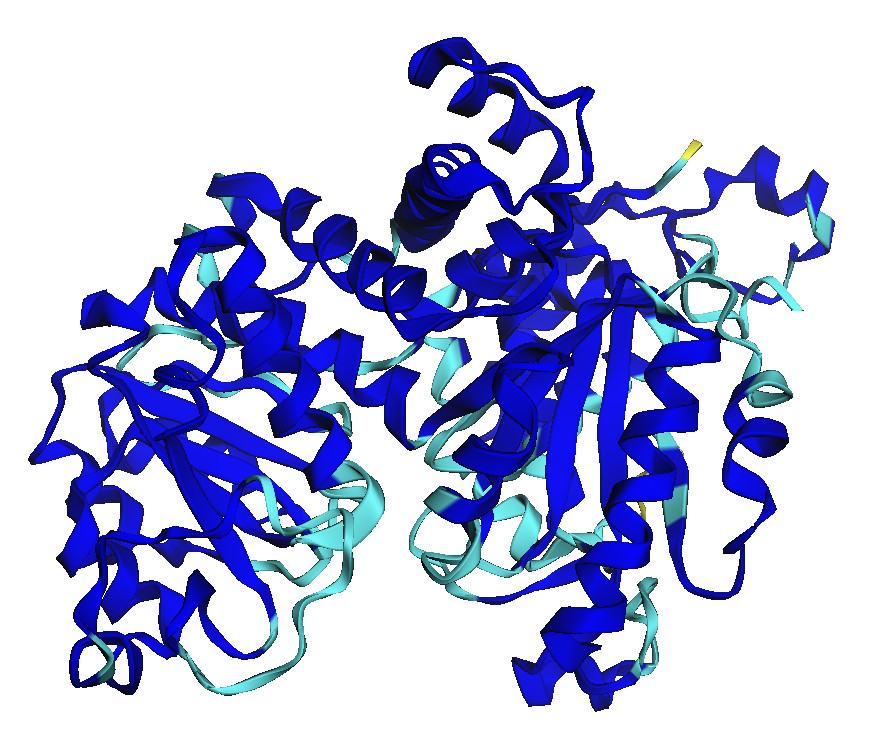

# 1. Quick Start


This guide assumes you're hosting NIM on your own infrastructure. See [Get access to NIMs](../../nim-setup/1.-request-nim-access.md) page on the different ways to access NIM. Search [this page](https://docs.nvidia.com/) for official docs on NIMs


## Prerequisites

1. Complete the **NIM Setup** section.&#x20;

## Step 1. Download NIM container

1.  SSH into your instance, then run NGC setup. If you do not have NGC preinstalled, you can install it from [here](https://org.ngc.nvidia.com/setup/installers/cli).&#x20;

    ```bash
    ngc config set
    ```
2.  Log into docker.

    ```bash
    docker login nvcr.io
    Username: $oauthtoken
    Password: YOUR_API_KEY
    ```
3.  Run

    ```bash
    docker pull nvcr.io/nvidia/nim/bionemo_esmfold_nim:24.03.01
    ```
4.  Download model

    ```bash
    mkdir -p ~/esmfold-nim/{weights,models}
    ```

    Then

    
    ```bash
    ngc registry model download-version nvidia/nim/bionemo-esmfold:protein-folding_noarchx1_bf16_24.03 --dest ~/esmfold-nim/models/
    ```
    
5.  Download the folding module weights.

    
    ```bash
    curl -L https://dl.fbaipublicfiles.com/fair-esm/models/esmfold_3B_v1.pt --output ~/esmfold-nim/weights/esmfold_3B_v1.pt
    ```
    
6.  Download the ESM2 3B language model weights.

    
    ```bash
    curl -L https://dl.fbaipublicfiles.com/fair-esm/models/esm2_t36_3B_UR50D.pt --output ~/esmfold-nim/weights/esm2_t36_3B_UR50D.pt
    ```
    
7.  Download the contact regression model weights.

    
    ```bash
    curl -L https://dl.fbaipublicfiles.com/fair-esm/regression/esm2_t36_3B_UR50D-contact-regression.pt --output ~/esmfold-nim/weights/esm2_t36_3B_UR50D-contact-regression.pt
    ```
    
8.  Run NIM container

    ```bash
    docker run --rm -it \
    --name bionemo-esmfold \
    --gpus all \
    -v ~/esmfold-nim/models/bionemo-esmfold_vprotein-folding_noarchx1_bf16_24.03/:/config/models \
    -v ~/esmfold-nim/weights/:/esm_models \
    -e MODEL_PATH=/config/models \
    -p 8008:8008 \
    nvcr.io/nvidia/nim/bionemo_esmfold_nim:24.03.01
    ```
9.  Wait until it shows up like this

    ```
    I0421 21:04:17.461556 81 grpc_server.cc:2519] Started GRPCInferenceService at 0.0.0.0:8001
    I0421 21:04:17.461909 81 http_server.cc:4637] Started HTTPService at 0.0.0.0:8000
    I0421 21:04:17.503485 81 http_server.cc:320] Started Metrics Service at 0.0.0.0:8002
    ```

## Step 2. Health check

1.  Run health check at

    ```
    curl http://server-ip4-address:8008/health/ready
    ```

    Should return True
2.  To view docs and API schema, go to

    ```
    http://server-ip4-address:8008/docs
    ```

## Step 3. Predict

### 3.1 Import packages

````python
```python
import requests
import os
```
````

### 3.2 Set up the urls


```python
# base_url is the <ip_4_address>:8008. Below is an example using EC2 ip4 address
base_url = "http://3.237.1.149:8008" # note on AWS this is generally HTTP not HTTPS
query_url = base_url + "/protein-structure/esmfold/predict"
health_check_url = base_url + "/health/ready"

# output directory
output = "output/esmfold_result"
os.makedirs(output, exist_ok=True)


# run health check
response = requests.get(health_check_url)
assert response.text == "true", "Health check failed"
```


### 3.3 Predict


Currently, the model is setup so that only 1 amino acid sequence can be submitted per request



````python
```python
def predict(url, sequence):
    """
    Main function to submit the requests to NIM sever
    url: str, the url to send the request to
    sequence: str, single amino acid sequence
    return JSON response
    """
    
    data = {
        "sequence": sequence,
    }
    
    headers = {"Content-Type": "application/json"}
    
    response = requests.post(url, headers=headers, json=data)
    
    if response.status_code == 200:
        print("Request successful, output saved to output.json")
    else:
        print(f"Request failed with status code {response.status_code}")
        print("Response:", response.text)
        
    return response.json()
```
````


Now we can call this function:&#x20;


````python
```python
# Example usage
sequence = "AILTDRYINRGTAFTMEERQKLHILGRLPPVVETLEEQVARVYGQVKKYEKPINRYQHLVSVHSTNTTLYYATILAHLEEMLPIIYTPTVGEACMEYSHLFFRERGVYFNRLYKGQFRNIMRDAGYQKVEVVVITDGSRILGLGDLGSNGIGISIGKCSLYVAGAGIDPRLIVPVILDVGTNNERYLQDKDYLGMREKRLGDEEFYELLDEFMEAASAEWPNAVIQFEDFSNNHCFDIMERYQKKYRCFNDDIQGTGAVIAAGFLNAIKLSGVSPLQQRIVVFGAGSAAVGVANNIAALAARMYKFPVQDLVKTFYLVDTKGLVTTTRGDQLAAHKKLLARTDVSAEDSAKLRTLEEIVRFVKPTTLLGLGGVGPAFTEEIVKMVMQNTERPIIFPLSNPTSKAEVTPENAYKWTNGAAIVASGSPFPPTTIGGKTFKPSQGNNLYVFPGVGLGCALAQPTHIPEELLLTASESLNLLTTEGDLREGRLYPPLEDIHNISANVATDVILEAQRMKIDNNKKLPRTRDELLAFVKKAMWKPVYSG"

result = predict(
    url=query_url,
    sequence=sequence
)
```
````


### 3.4 Analyze results

#### Save the PDB files

The `result` is a dictionary:&#x20;

````python
```python
# The result is a dictionary containing the following keys:
result.keys()
```
````

Output:&#x20;

```
dict_keys(['pdbs'])
```

You can write the PDB files:&#x20;


```python
# Write PDB file 
for i, structure in enumerate(result["pdbs"]):
    fp = os.path.join(output, f"prediction_{i}.pdb")
    with open(fp, "w") as f:
      f.write(structure)
```


#### Visualize by PLDDT score

The PLDDT score is stored as a B-factor in the PDB file. &#x20;

**To load the PDB structure in pymol and display PLDDT score:**&#x20;

1. Download the `coloraf.py` from cbalbin-bio's repository [here](https://github.com/cbalbin-bio/pymol-color-alphafold). &#x20;
2. Load the PDB file into Pymol.&#x20;
3.  Download Pymol, and run these command, line by line, in Pymol:&#x20;

    
    ```bash
    cd /Users/mightycamole/Desktop/pymol/pymol_scripts
    run coloraf.py
    coloraf <pymol_object_name>
    ```
    

Output will look like this:&#x20;

<figure><figcaption><p>Example output of ESMFold, colored by PLDD score</p></figcaption></figure>


## Notes

### ESMFold is deterministic

ESMFold is deterministic and will generate the same structure.&#x20;

### Accessing ESMFold NIM using localhost

Instead of using the ip4 address such as `"http://3.237.1.149:8008"` , you can also access ESMFold NIM via local host.  In this case, your data should be accesible by the same instance where the NIM is served. Sometimes this provides faster inference because data does not have to be transmitted over internet to the server. The NIM setup process is the same as before, except the base url should be:&#x20;

```python
# use this to access ESMFold NIM locally
base_url = "http://0.0.0.0:8008"
```

