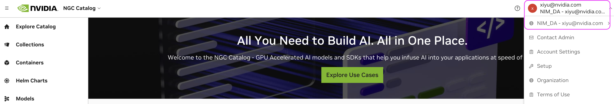

# 1. Request NIM access

There are 2 ways to use BioNeMo NIMs:&#x20;

1. free trial where the server is hosted on NVIDIA's resources (aka hosted API). or&#x20;
2. &#x20;a downloadable docker container which you can run on your own infrastructure.&#x20;

### Free trial using hosted API

The first hosted API approach is relatively straightforward. Simply go to [build.nvidia.com](https://build.nvidia.com/explore/discover) , create a free account, and start using the models through the playground. The playgorund will also display the API code if you want to try it out.&#x20;

<figure><figcaption>
BioNeMo NIM example playground
</figcaption></figure>

### Self-host (or downloadable) NIM

We will cover the second approach (downloadable docker container, or self-host container) in this guide.&#x20;

#### Models with the RUN ANYWHERE tag&#x20;

Models with the `RUN ANYWHERE` tag can be downloaded as soon as you start the NVAIE trial. There is no&#x20;

<figure><figcaption>
RUN ANYWHERE
</figcaption></figure>

Click into the model, then click `Build with this NIM`

<figure><figcaption></figcaption></figure>

Start with a free 90 day NVAIE trial. Once you start it, your NGC API KEY will be automatically enabled for NAVIE.&#x20;

#### Models that do not have RUN ANYWHERE tag

1. First follow this document [here](https://drive.google.com/file/d/1Fhz\_9ed9D0YLl0LZX8BdA022d7aShpz5/view?usp=sharing) to request for access to downloadable NIM.&#x20;
2.  Once you're approved for access to the downloadable container, you will receive an email to invite you to access NIM. **You must accept invite through the email first**. Then, if you [log into NGC](https://ngc.nvidia.com/signin), click on the top right corner, you will see something like this: `NIM_DA-<your email>.`&#x20;

    <figure><figcaption>
NGC Org for NIM
</figcaption></figure>
3. your NGC API key will automatically enable you to docker pull the NIM containers. Follow the next step to configure the API key
