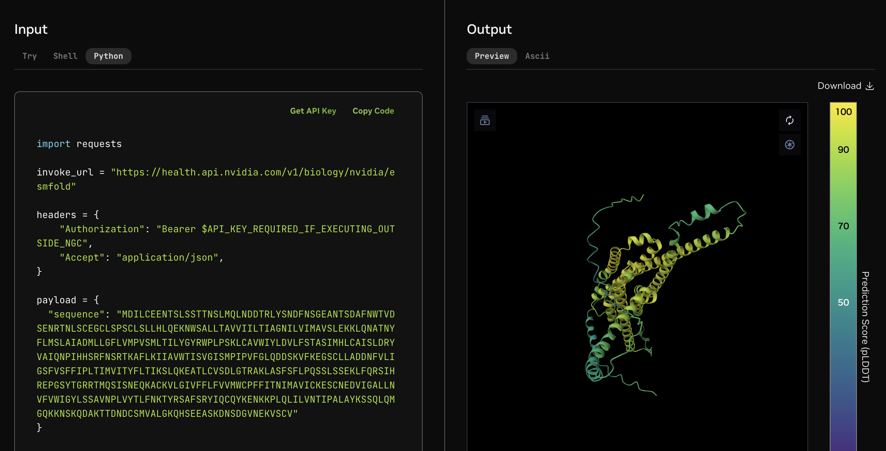

# 1. Get access to NIMs

There are 2 ways to use BioNeMo NIMs:

1. Free trial where the server is hosted on NVIDIA's resources (aka hosted API). or ;
2. A downloadable docker container which you can run on your own infrastructure.

### Free trial using hosted API

The first hosted API approach is relatively straightforward. Simply go to [build.nvidia.com](https://build.nvidia.com/explore/discover) , create a free account, and start using the models through the playground. The playgorund will also display the API code if you want to try it out.

<figure><figcaption>
BioNeMo NIM example playground
</figcaption></figure>

### Self-host (or downloadable) NIM

We will cover the second approach (downloadable docker container, or self-host container) in this guide.

#### Models with the RUN ANYWHERE tag

Models with the `RUN ANYWHERE` tag can be downloaded as soon as you start the NVAIE trial. There is no

<figure><figcaption>
RUN ANYWHERE
</figcaption></figure>

Click into the model, then click `Build with this NIM`

<figure><figcaption></figcaption></figure>

Start with a free 90 day NVAIE trial. Once you start it, your NGC API KEY will be automatically enabled for NAVIE.

#### Models that do not have RUN ANYWHERE tag

Contact NVIDIA team to request access.&#x20;
