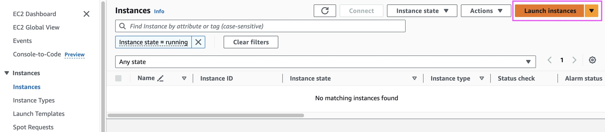
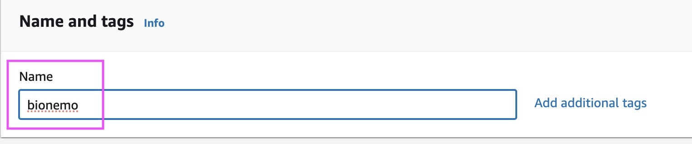
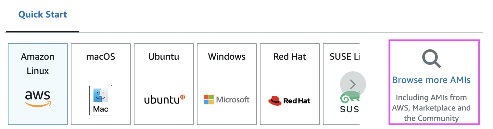
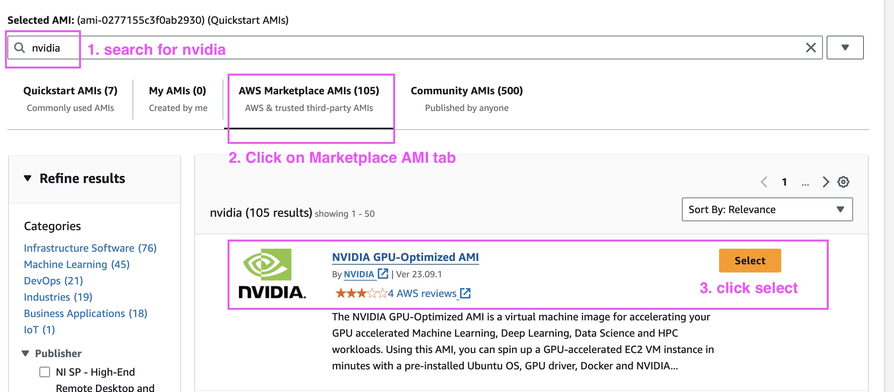
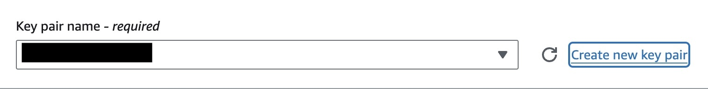
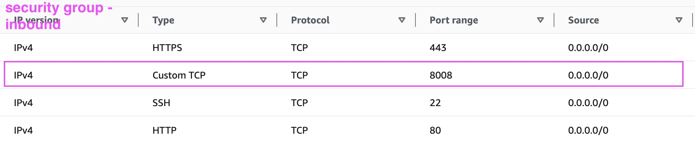
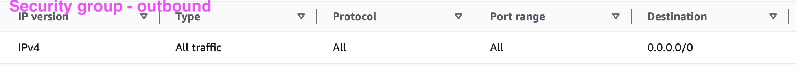
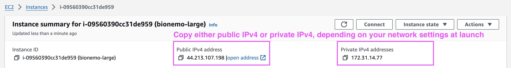

# EC2

## Prerequisites


[1.-get-access-to-nims.md](../1.-get-access-to-nims.md)



[2.-configure-ngc-api-key.md](../2.-configure-ngc-api-key.md)


## Steps

### Step 1: Launch an EC2 instance

1.  In [AWS EC2 console](https://us-east-1.console.aws.amazon.com/ec2/home?region=us-east-1), click on **Launch Instance**. This will open a instance specification page.

    <figure><figcaption><p>Launch Instance</p></figcaption></figure>
2.  **Name**: enter a name for your instance

    <figure><figcaption><p>Name Instance</p></figcaption></figure>
3. Under **Application & OS Images**:
   *   select **Browse more AMIs**.

       <figure><figcaption><p>Browse AMIs</p></figcaption></figure>
   *   Type `nvidia` in the search bar. Press `Enter`. Then click on **AWS Marketplace AMI**. Then select **NVIDIA GPU Optimized VMI** and click on **Select**.

       <figure><figcaption><p>choose AMI</p></figcaption></figure>
   * When prompted, select **Subscribe Now**
4. Under **instance type**, select **g5.16xlarge**.
5.  Under **key pair**: Choose an existing key pair or create a new one. If you create a new one, enter a keypair name, then select **RSA** and **.pem**. Download the **.pem** file for later use.

    <figure><figcaption><p>choose key pair</p></figcaption></figure>
6.  Under **Network settings**: choose the network, subnet, and security group that you want to use. For **security group**, you must open a **TCP port 8008** to interact with the BioNeMo NIM API interface. An example security group with inbound and outbound rules is shown below. Configure the source as needed.&#x20;

    <figure><figcaption><p>security-group-inbound</p></figcaption></figure>

    <figure><figcaption><p>security-group-outbound</p></figcaption></figure>
7. Keep other settings default (or change them as needed). At least 124G root EBS volume is recommended as shown in the default setting.
8. Click on **Launch Instance**. Wait until the `Instance State` becomes `running`.

### Step 2. Connect to a running instance

1.  In the EC2 console, wait until the instance state becomes `running`. Then copy the **Public IP4 address** or **Private IP4 address** of the instance, depending on your network settings.

    <figure><figcaption><p>copy IP</p></figcaption></figure>
2.  Open a terminal at the local folder where you keep the **.pem** file that was used during instance launch. Run the following command to change the permissions of the **.pem** file. Replace `your-key-pair.pem` with the name of your **.pem** file.

    ```shell
    chmod 400 your-key-pair.pem
    ```
3.  SSH into the instance.Replace `your-ip4-address` with the public or private IP4 address of your instance.

    ```shell
    ssh -i your-key-pair.pem -L 8888:127.0.0.1:8888 ubuntu@your-ip4-address
    ```
4. The first time when you log into the instance, driver installation will start automatically. Wait until the system is ready.

### Step 3. Configure NGC and Docker

1.  NGC CLI should already been preinstalled if you're using the NVIDIA GPU Optimized AMI. (If not, you can install it from [here](https://org.ngc.nvidia.com/setup/installers/cli)).  In the ubuntu terminal, type

    ```shell
    ngc config set
    ```
2. Enter the information as prompted:
   * `API key`: enter API key. **Note that this has to be a API key with NVAIE entitlement** (e.g. you have started a NVAIE trial, or your account has an active NAVIE license)**.**&#x20;
   * `CLI output`: accept default (ascii) by pressing `Enter`
   * `org`: Enter the NGC org you're assigned with, or just use default.&#x20;
   * `team`: Enter the NGC team you're assigned with, or just use default.&#x20;
   * `ace`: Enter the `ace` and press `Enter`, or just use default.&#x20;
3.  If this is a newly created instance, in order to use docker without `sudo`, run:

    ```shell
    newgrp docker
    ```

    Alternatively, you can just exit the SSH connection and reconnect.&#x20;
4.  Log into docker with&#x20;

    ```shell
    docker login nvcr.io
    ```

    Username should be exactly the phrase `$oauthtoken` . Password should be NGC API key.&#x20;
5.  Check if `NGC_API_KEY` environment variable already exists:&#x20;

    ```shell
    echo $NGC_API_KEY
    ```

    If returns nothing, set it by

    ```shell
    echo "export NGC_API_KEY=YOUR_API_KEY" >> ~/.bash_profile \
    && source ~/.bash_profile
    ```
6. Continue with the **NIM Models** section for the quick start guide on specific models.&#x20;


## Notes

### Choice of instance type.

We test BioNeMo on A100, H100, but usually V100 and A10 can also be used.

### Alternative virtual machine images

Instead of using the  **NVIDIA GPU Optimized VMI** , you can also use other VMI from the market place, provided by AWS, or built by your self. The general consideration is:&#x20;

1. x86 Linux system (e.g. Ubuntu 22.04) with GPU support. See [this page](https://docs.nvidia.com/bionemo-framework/latest/pre-reqs.html) for more details
2. Docker
3. CUDA drivers
4. NVIDIA docker container toolkits.&#x20;

The easiest way to test if you have these ready is by running this command:&#x20;

```bash
docker run --rm --runtime=nvidia --gpus all ubuntu nvidia-smi
```

It should produce something similar to this, depending on your system

```
+-----------------------------------------------------------------------------------------+
| NVIDIA-SMI 550.54.14              Driver Version: 550.54.14      CUDA Version: 12.4     |
|-----------------------------------------+------------------------+----------------------+
| GPU  Name                 Persistence-M | Bus-Id          Disp.A | Volatile Uncorr. ECC |
| Fan  Temp   Perf          Pwr:Usage/Cap |           Memory-Usage | GPU-Util  Compute M. |
|                                         |                        |               MIG M. |
|=========================================+========================+======================|
|   0  NVIDIA H100 80GB HBM3          On  |   00000000:1B:00.0 Off |                    0 |
| N/A   36C    P0            112W /  700W |   78489MiB /  81559MiB |      0%      Default |
|                                         |                        |             Disabled |
+-----------------------------------------+------------------------+----------------------+

+-----------------------------------------------------------------------------------------+
| Processes:                                                                              |
|  GPU   GI   CI        PID   Type   Process name                              GPU Memory |
|        ID   ID                                                               Usage      |
|=========================================================================================|
|  No running processes found                                                             |
+-----------------------------------------------------------------------------------------+
```

### Volume

Instead of creating a local folder on EBS, you can also mount [EFS](https://aws.amazon.com/efs/) or [Lustre](https://aws.amazon.com/fsx/lustre/) folders to share across EC2 instances
