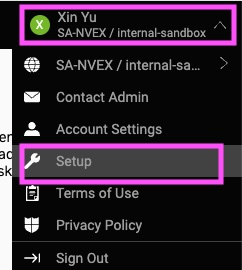
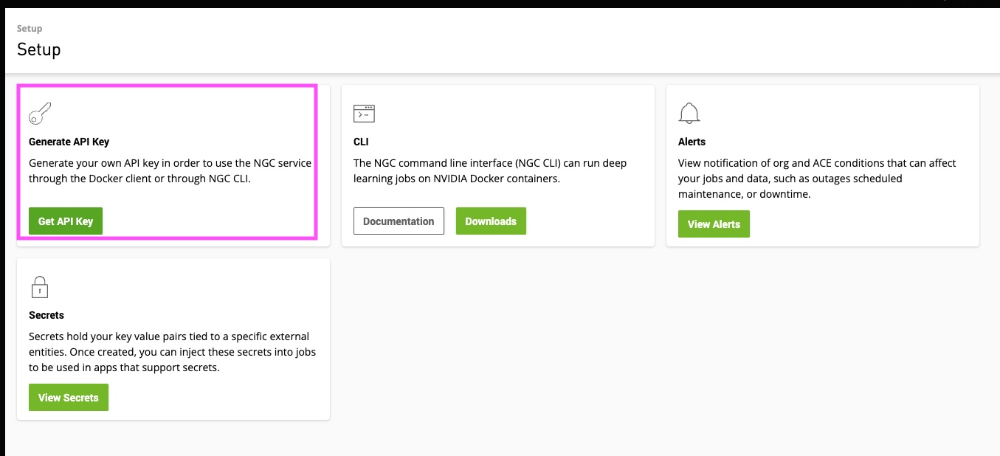

# Configure NGC API Key

### Steps

1. Create an account on [NGC](https://bc.ngc.nvidia.com/jobs) where you can access clusters and launch training jobs.

2. Log into NGC account. Then click on **user** on top right corner, then **Setup**
    <figure><figcaption>
NGC API Key
</figcaption></figure>
3. Click on **Generate API Key**
   <figure><figcaption>
NGC API Key
</figcaption></figure>
4. Copy the API key.
5. Install NGC CLI from [here](https://ngc.nvidia.com/setup/installers/cli)
6. Open a terminal from your local machine, run\
   \-  `ngc config set` \
   \-  `API key`: enter API key\
   \-  `CLI output`: accept default (ascii) by pressing `Enter` \
   \- `org`: Choose from the list the NGC org that you have access to. \
   \- `team`: Choose from the NGC team you're assigned with 8. `ace`: choose a ACE, otherwise press `Enter`

## Notes

1. `org`, `team` is only important when you are pulling private containers/datasets from NGC that you or your team created. For BioNeMo Framework, just choose the default value.
2. `ace` only matters if you're using NGC to run the job. If you're using AWS, just choose any from the options provided by the prompt.
