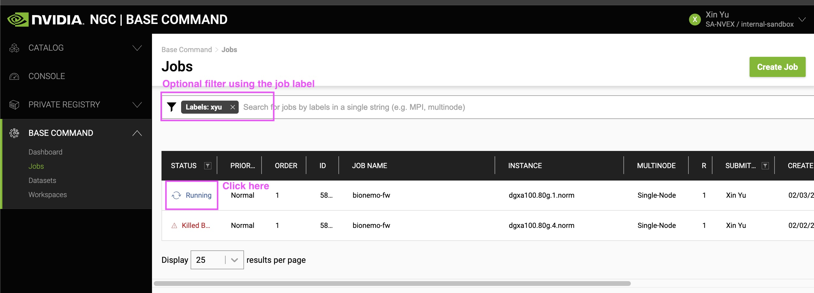
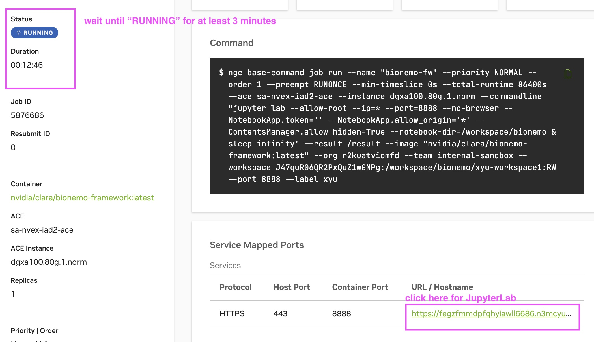
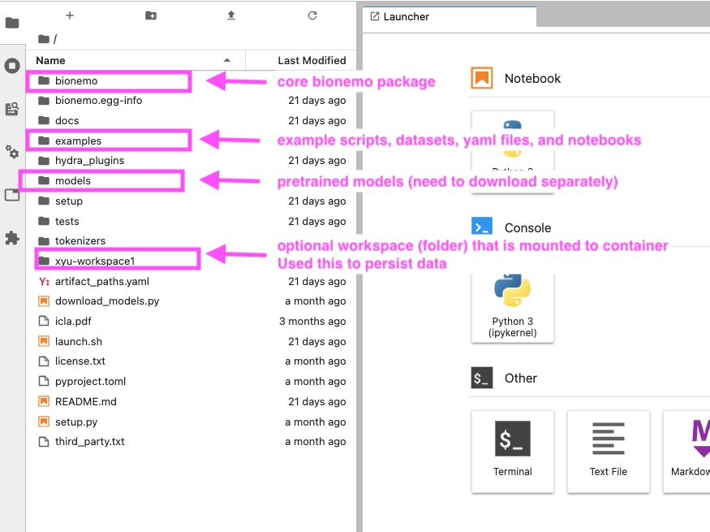

# Launch container on NGC

## Prerequisites


A valid ACE is required to run compute on NGC. Please contact NVIDIA team for NGC access & credentials


## Steps

1.  Open a terminal on your local machine, run the following command
  ```shell
  ngc batch run \
    --name bionemo-fw \
    --team internal-sandbox \
    --ace sa-nvex-iad2-ace \
    --instance dgxa100.80g.1.norm \
    --image nvcr.io/nvidia/clara/bionemo-framework:1.5 \
    --port 8888 \
    --workspace xyu-workspace1:/workspace/bionemo/xyu-workspace1:RW \
    --result /result \
    --total-runtime 1D \
    --order 1 \
    --label xyu \
    --commandline "jupyter lab --allow-root --ip=* --port=8888 --no-browser --NotebookApp.token='' --NotebookApp.allow_origin='*' --ContentsManager.allow_hidden=True --notebook-dir=/workspace/bionemo & sleep infinity"
  ```
  Explanation:
    - `--name`: Change to name of your job
    - `--team`: Change to team in NGC org that you're assigned with
    - `--ace`: Change to ACE that you're assigned with
    - `--instance`: Change instance type for this job. For example, `dgxa100.80g.1.norm` for 1 GPU A100 instance
    - `--image`: BioNeMo framework container image
    - `--port`: port number to access JupyterLab
    - `--workspace`: Optional flag. Mount NGC workspace to the container with read+write access to persist data. Replace `xyu-workspace1` with your workspace name
    - `--result`: directory to store the job results
    - `--total-runtime`: total runtime of the job. For example, `1D` for 1 day. After this time, the job will be terminated
    - `--order`: order of the job. Just set it to 1 for now
    - `--label`: Change to your job label. This allows quick filter on NGC dashboard
    - `--commandline`: command to run inside the container. In this case, we start JupyterLab and keep it running with `sleep infinity`
2. Go to [NGC dashboard](https://bc.ngc.nvidia.com/jobs). Click into your job.
  <figure><figcaption><p>NGC Dashboard</p></figcaption></figure>
3. Wait until the status shows `Running` for 3 minutes. Then click on the link to access JupyterLab.
  <figure><figcaption><p>NGC Job</p></figcaption></figure>
4. In the terminal, run the `ngc config set` again to set the NGC credentials inside the container. If NGC is not installed, go to [this page](https://org.ngc.nvidia.com/setup/installers/cli) to install it.
5. To download the pretrained model weights, open a terminal in JupyterLab, and run
  ```shell
  cd /workspace/bionemo
  python download_models.py all --source ngc --download_dir ${BIONEMO_HOME}/models --verbose
  ```
  This will download models to `/workspace/bionemo/models` folder.
  Optionally, persist the models by copying them to your workspace
  ```shell
  mkdir -p xyu-workspace1/bionemo && cp -r models xyu-workspace1/bionemo/models
  ```
6. The final directory structure should look like this:
  <figure><figcaption><p>NGC JupyterLab</p></figcaption></figure>

